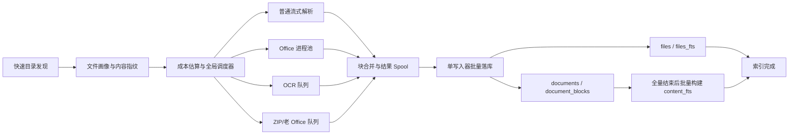

# 本地全文搜索全量索引性能优化开发设计

> 历史说明：本文中的固定单文件超时和 `partial_success` 发布方案已被“无进展超时 + 完整索引门槛”替代，以《完整索引与搜索界面修改说明》为准。

> 文档状态：设计稿，可直接作为 Codex 分阶段开发任务输入
> 编写日期：2026-07-27
> 适用项目：`everything-finder` / `LocalFullTextSearch`
> 核心目标：降低从“开始建立索引”到“全部文件完成索引”的总墙钟时间

## 1. 需求定义

### 1.1 核心需求

本次优化关注完整索引任务的最终完成时间，不以“前几个文件更早可搜索”为主要目标。

必须满足：

1. 在不升级 CPU、内存、硬盘等硬件的前提下，显著降低全量索引总耗时。
2. 默认模式不得通过跳过正文、表格、备注、页眉页脚或降低搜索能力换取速度。
3. 全量索引可以采用批处理策略，允许在解析阶段结束后统一构建 FTS，不要求边解析边搜索。
4. 必须保持增量索引能力，未变化文件不得重复解析。
5. 必须支持取消、异常退出和断点续建，不能因为一次退出重做大量已完成文件。
6. 必须限制内存和子进程数量，避免操作系统换页导致整机卡顿。
7. 程序空闲时不得自动启动全量扫描；关闭后台任务时进程应在 3 秒内退出。
8. 优化后的开发版和冻结 EXE 都必须通过功能、性能、退出和进程回收验证。

### 1.2 明确的非目标

以下内容不是本项目的主要优化目标：

- 仅调整普通、OCR、ZIP 队列优先级，使普通文件更早可搜索。
- 单纯增加线程数或进程数。
- 只缩短目录枚举时间。
- 通过默认关闭必要内容解析换取更快完成。
- 通过要求用户更换硬件解决性能问题。

### 1.3 默认无损原则

默认配置必须保留当前可搜索内容范围：

- DOCX：正文、表格、页眉、页脚。
- PPTX：幻灯片文字、组合形状文字、表格、备注。
- XLSX/XLSM：工作表有效单元格、公式文本、批注和位置范围。
- PDF：原生文字；启用扫描 PDF OCR 时保留 OCR 文字。
- 图片：启用图片 OCR 时保留识别文字。
- ZIP：安全限制内的受支持成员和嵌套 ZIP。
- DOC/XLS/PPT：转换后正文。
- TXT/LOG/CSV/MD/JSON/XML/INI：完整文本。

任何可能减少内容覆盖的策略必须作为显式高级选项，默认关闭。

## 2. 当前基线与瓶颈

### 2.1 实际目录画像

以当前搜索根目录 `E:\免疫资料` 的只读统计为基线：

| 指标 | 当前值 |
|---|---:|
| 文件总数 | 337 |
| 文件总体积 | 17.21 GiB |
| 目录枚举耗时 | 0.14 秒 |
| DOCX | 143 个 / 1.98 GiB |
| PPTX | 51 个 / 2.75 GiB |
| PDF | 65 个 / 0.589 GiB |
| XLSX | 34 个 / 0.014 GiB |
| 老版 DOC/PPT | 14 个 / 0.555 GiB |
| JPG | 6 个 / 0.007 GiB |
| MP4 元数据文件 | 22 个 / 11.25 GiB |

结论：

- 目录扫描不是瓶颈。
- MP4 虽然体积大，但当前仅索引元数据，不读取视频内容。
- OCR 文件数量很少，当前目录的主要瓶颈不是图片 OCR。
- 主要耗时集中在大型 DOCX、PPTX、老版 Office 转换和 FTS 写入。

### 2.2 OOXML 有效文字负载

通过读取 ZIP 中央目录统计文字相关 XML：

| 类型 | 文件总体积 | 文字 XML 压缩体积 | 占比 |
|---|---:|---:|---:|
| DOCX | 1.98 GiB | 138.32 MiB | 6.82% |
| PPTX | 2.75 GiB | 10.69 MiB | 0.38% |
| 合计 | 4.73 GiB | 149.01 MiB | 约 3.1% |

当前 `python-docx` 和 `python-pptx` 对完整包建立对象模型，处理了大量与全文索引无关的图片、媒体和关系对象。新解析器应只读取文字相关 XML。

### 2.3 文本块和数据库现状

当前索引数据库约 `216.69 MiB`，包含 `41,660` 个文本块：

| 类型 | 文本块数 | 平均规范化文字长度 |
|---|---:|---:|
| DOCX | 19,882 | 28.5 |
| XLSX | 8,429 | 74.2 |
| DOC | 5,245 | 25.8 |
| PDF | 3,940 | 450.3 |
| PPTX | 3,405 | 127.5 |

问题：

- DOCX 几乎按每个短段落写一条 SQLite 和 FTS 记录。
- 文件名和完整路径在每个内容块的 FTS 行中重复分词。
- 解析线程与数据库写入没有形成独立流水线。
- 进程池结果完成后会同步物化并写库，阻塞调度线程继续排空结果。

### 2.4 重复内容

当前目录有 18 份疑似重复的可解析文档，约 `0.96 GiB`。当前实现按路径解析，不复用相同内容的解析结果和 FTS 数据。

### 2.5 进程调度现状

- 129 个 DOCX 和 1 个 XLSX 大于 4 MiB，会进入 Office 进程池。
- 49 个 PPTX 大于 4 MiB，但当前仍走普通线程。
- 子进程默认每处理 8 个任务回收。
- Windows 使用 spawn，频繁回收会重复启动解释器、导入依赖和初始化解析器。
- `max_pending_parse_tasks` 已不参与实际调度。
- 每个任务只按“文件个数”计费，338 MiB PPTX 与 50 KiB 文件占用相同队列配额。

### 2.6 中断恢复现状

当前数据库中存在大量 `processing` 文件。元数据入队时即标记为 processing，而不是实际提交给工作线程时才标记。异常退出后，排队但从未开始的文件也会作为未完成任务重新处理。

## 3. 验收指标

### 3.1 正确性指标

1. 固定测试语料中的预期关键词命中率必须为 100%。
2. 新旧解析器对已有正文、表格、备注、页眉页脚的规范化文字集合必须等价。
3. 块合并可以改变块边界，但不得改变文字顺序和可搜索内容。
4. 重复内容缓存不得合并文件路径；搜索结果仍需返回所有实际路径。
5. 数据库迁移、取消和崩溃恢复后不得产生孤立块、错误 FTS 行或永久 processing 任务。

### 3.2 性能指标

先由 Phase 0 生成可重复基线，再使用相同语料、相同配置比较。

| 指标 | 目标 |
|---|---|
| 实际 337 文件全量索引总耗时 | 不高于基线的 50% |
| Office 解析阶段总耗时 | 不高于基线的 35% |
| FTS 构建和数据库写入耗时 | 不高于基线的 40% |
| 重复文档二次解析次数 | 0 |
| 未变化目录增量扫描 | 不超过 2 秒 |
| 后台任务关闭到进程退出 | 不超过 3 秒 |
| 空闲 CPU | 不得存在自动全量扫描 |
| 峰值内存 | 不超过配置预算，默认建议 2 GiB 上限 |

`50%` 是项目验收目标，不是开发前承诺。若未达到，必须依据阶段计时继续定位，不能通过减少默认索引内容规避。

### 3.3 稳定性指标

- 全量索引连续运行 3 次无崩溃、无子进程遗留。
- 在解析、写库、FTS 构建三个阶段分别强制退出，均可恢复。
- 冻结 EXE 下进程池可以创建、回收、取消和强制终止。
- 任一单文件解析失败不阻止其他文件完成。

## 4. 目标架构



核心变化：

1. 先快速发现全部文件，再按预计成本调度，优化最终完成时间。
2. 使用内容实体和路径实体分离的数据库模型。
3. 相同内容只解析、规范化和构建 FTS 一次。
4. 解析与数据库写入并行流水化。
5. 全量模式延迟构建 FTS；增量模式仍支持小批量在线更新。
6. 调度同时限制任务数和在途字节数。

## 5. 详细设计

### 5.1 Phase 0：性能可观测性

在修改解析算法前增加阶段计时，否则无法证明优化效果。

新增数据结构：

```python
@dataclass(slots=True)
class IndexRunMetrics:
    run_id: str
    discovered_files: int
    discovered_bytes: int
    scan_ms: int
    fingerprint_ms: int
    parse_ms_by_lane: dict[str, int]
    normalize_ms: int
    spool_write_ms: int
    database_write_ms: int
    fts_build_ms: int
    total_ms: int
    peak_rss_bytes: int
    process_spawn_count: int
    cache_hits: int
    cache_misses: int

@dataclass(slots=True)
class FileTiming:
    file_id: int
    extension: str
    size_bytes: int
    queue_name: str
    queue_wait_ms: int
    parse_ms: int
    block_count: int
    text_chars: int
    spool_bytes: int
    worker_pid: int | None
```

新增表：

```sql
CREATE TABLE index_runs (
    id TEXT PRIMARY KEY,
    started_at TEXT NOT NULL,
    finished_at TEXT,
    mode TEXT NOT NULL,
    status TEXT NOT NULL,
    discovered_files INTEGER NOT NULL DEFAULT 0,
    discovered_bytes INTEGER NOT NULL DEFAULT 0,
    scan_ms INTEGER NOT NULL DEFAULT 0,
    parse_ms INTEGER NOT NULL DEFAULT 0,
    write_ms INTEGER NOT NULL DEFAULT 0,
    fts_ms INTEGER NOT NULL DEFAULT 0,
    total_ms INTEGER NOT NULL DEFAULT 0,
    peak_rss_bytes INTEGER NOT NULL DEFAULT 0,
    summary_json TEXT
);

CREATE TABLE index_file_metrics (
    run_id TEXT NOT NULL,
    file_id INTEGER NOT NULL,
    extension TEXT,
    size_bytes INTEGER,
    queue_name TEXT,
    queue_wait_ms INTEGER,
    parse_ms INTEGER,
    block_count INTEGER,
    text_chars INTEGER,
    spool_bytes INTEGER,
    worker_pid INTEGER,
    PRIMARY KEY(run_id, file_id)
);
```

只保留最近 3 次完整运行的逐文件指标，避免指标表无限增长。

### 5.2 流式 DOCX 解析

新增 `parsers/ooxml/docx_stream_parser.py`，使用 `zipfile.ZipFile` 与 `lxml.etree.iterparse`，不得实例化 `python-docx.Document`。

读取范围：

- `word/document.xml`
- `word/header*.xml`
- `word/footer*.xml`
- 当前实现已覆盖范围内的表格结构

处理规则：

- `w:t` 追加文字。
- `w:tab` 转换为制表符。
- `w:br` 和 `w:cr` 转换为换行。
- `w:p` 形成逻辑段落边界。
- `w:tr` 保留表格行边界。
- 对链接到相同 XML part 的页眉页脚只解析一次。
- 解析完成元素后立即 `element.clear()`，释放父节点引用。
- XML 解析必须禁用外部实体和网络访问。

兼容策略：

- 对损坏、加密或解析器不支持的 OOXML，回退到原 `DocxParser`。
- 通过 `fast_ooxml_enabled` 特性开关控制灰度。
- 新解析器和旧解析器必须运行 golden parity 测试。

### 5.3 流式 PPTX 解析

新增 `parsers/ooxml/pptx_stream_parser.py`。

只读取：

- `ppt/slides/slide*.xml`
- 实际存在的 `ppt/notesSlides/notesSlide*.xml`
- 必要的关系文件，用于稳定幻灯片与备注映射

处理规则：

- 按幻灯片编号排序。
- 收集 `a:t` 文本并保持 XML 文档顺序。
- 表格单元格按行拼接。
- 组合形状中的文字自然包含在 XML 遍历结果中。
- 不访问图片、音频、视频、缩略图、主题资源和嵌入对象。
- 不得通过 `slide.notes_slide` 创建不存在的备注对象。

### 5.4 流式 XLSX 解析

新增 `parsers/ooxml/xlsx_stream_parser.py`，替换大部分 `openpyxl` 热路径。

读取：

- `xl/workbook.xml`
- `xl/_rels/workbook.xml.rels`
- `xl/sharedStrings.xml`
- `xl/worksheets/sheet*.xml`
- 必要时读取 styles，用于日期和数字格式兼容

处理要求：

- 只遍历真实存在的 `<c>` 单元格，避免稀疏工作表产生大量 `EmptyCell`。
- 支持 shared string、inline string、公式、布尔值和数字。
- 保留 Sheet 名、首尾单元格和行号。
- 解析批注时仅加载存在批注关系的工作表。
- 不支持的复杂格式回退到 `openpyxl`。

### 5.5 内容块合并器

新增 `core/block_coalescer.py`，解析器输出逻辑片段，合并器生成最终索引块。

默认规则：

| 类型 | 合并策略 |
|---|---|
| DOCX/DOC | 同一正文区域累计到 2,048-4,096 字符，最大 16,384 字符 |
| XLSX/XLS | 同一 Sheet 内 10-30 个非空行，最大 16,384 字符 |
| PPTX/PPT | 每张幻灯片和备注分别保留，不跨幻灯片合并 |
| PDF | 每页保留，不跨页合并 |
| TXT/LOG | 按字符预算与行号双重限制 |
| OCR | 每页或每图保留 |

块必须记录位置范围，例如：

```json
{
  "location_start": "正文第 21 段",
  "location_end": "正文第 38 段",
  "cell_start": "A10",
  "cell_end": "H29"
}
```

规范化只对合并后的最终块执行一次，减少大量 NFKC 和正则调用。

### 5.6 内容实体与路径实体分离

数据库升级为 schema v3。使用 `PRAGMA user_version` 管理迁移，不再只依赖全局 `PARSER_VERSION`。

目标表：

```sql
CREATE TABLE documents (
    id INTEGER PRIMARY KEY,
    content_key TEXT NOT NULL,
    parser_name TEXT NOT NULL,
    parser_version TEXT NOT NULL,
    parse_status TEXT NOT NULL,
    parse_error_code TEXT,
    parse_error_message TEXT,
    block_count INTEGER NOT NULL DEFAULT 0,
    text_chars INTEGER NOT NULL DEFAULT 0,
    created_at TEXT NOT NULL,
    UNIQUE(content_key, parser_name, parser_version)
);

ALTER TABLE files ADD COLUMN document_id INTEGER REFERENCES documents(id);

CREATE TABLE document_blocks (
    id INTEGER PRIMARY KEY,
    document_id INTEGER NOT NULL REFERENCES documents(id) ON DELETE CASCADE,
    block_index INTEGER NOT NULL,
    block_type TEXT NOT NULL,
    location_text TEXT,
    page_number INTEGER,
    slide_number INTEGER,
    sheet_name TEXT,
    cell_start TEXT,
    cell_end TEXT,
    line_start INTEGER,
    line_end INTEGER,
    raw_text TEXT,
    normalized_text TEXT,
    source_type TEXT,
    ocr_confidence REAL,
    extra_json TEXT,
    UNIQUE(document_id, block_index)
);
```

效果：

- 相同内容映射到同一个 `documents` 记录。
- 不同文件路径仍保留独立 `files` 记录。
- 正文块和正文 FTS 只保存一次。
- 搜索正文后通过 `files.document_id` 展开为所有真实路径。

### 5.7 内容指纹

不得默认对 11 GiB 的 metadata-only MP4 计算完整 SHA-256。

建议策略：

| 文件类型 | 内容键策略 |
|---|---|
| DOCX/PPTX/XLSX | 对相关 ZIP entry 的 name、CRC、原始大小和压缩大小排序后计算 SHA-256 |
| PDF | size + mtime 用于增量；检测疑似重复时再流式 SHA-256 |
| 图片 OCR | 复用 OCR cache 的 SHA-256 |
| TXT | 文件较小时完整 SHA-256；大文件采用分段指纹后按需验证 |
| MP4 元数据 | 不读取内容，仅使用路径元数据指纹 |
| 老 Office | 源文件流式 SHA-256，用于转换缓存 |

OOXML 内容键默认包含所有 ZIP entry 的中央目录元数据。可额外提供“文字内容键”，用于文本相同但媒体不同的文档复用文字解析结果。

### 5.8 FTS 拆分和延迟构建

文件名与路径单独建立一行一文件的 FTS：

```sql
CREATE VIRTUAL TABLE files_fts USING fts5(
    file_id UNINDEXED,
    filename,
    path,
    tokenize='trigram'
);
```

正文 FTS 不再重复存放文件名和路径：

```sql
CREATE VIRTUAL TABLE content_fts USING fts5(
    document_id UNINDEXED,
    location_text,
    normalized_text,
    content='document_blocks',
    content_rowid='id',
    tokenize='trigram'
);
```

`document_blocks.id` 通过 FTS 的 `rowid` 暴露，查询时使用
`content_fts.rowid AS block_id`，不在 FTS 列中重复声明不存在的
`block_id` 字段。

全量模式流程：

1. 清空或创建新的 staging 数据库。
2. 解析全部文件并写入 `files`、`documents`、`document_blocks`。
3. 不在逐文件写入时维护 `content_fts`。
4. 所有解析完成后使用 `INSERT ... SELECT` 批量构建 FTS。
5. 构建辅助索引。
6. 执行一致性检查、checkpoint 和原子切换。

增量模式仍逐文件维护 FTS，避免每次变化都重建全库。

### 5.9 SQLite 全量构建配置

仅对可重建的 staging 数据库使用：

```sql
PRAGMA journal_mode=WAL;
PRAGMA synchronous=OFF;
PRAGMA temp_store=MEMORY;
PRAGMA cache_size=-262144;
PRAGMA wal_autocheckpoint=0;
PRAGMA locking_mode=EXCLUSIVE;
```

完成后必须恢复：

```sql
PRAGMA synchronous=NORMAL;
PRAGMA wal_checkpoint(TRUNCATE);
PRAGMA locking_mode=NORMAL;
PRAGMA foreign_key_check;
PRAGMA integrity_check;
```

如果全量构建期间崩溃，只删除未完成 staging 数据库，不影响上一版可用索引。

### 5.10 单写入器流水线

新增 `core/index_writer.py`，只有写入器持有构建数据库写连接。

接口示例：

```python
class IndexWriter:
    def submit(self, artifact: ParseArtifact) -> None: ...
    def flush(self) -> None: ...
    def finish(self) -> WriterSummary: ...
    def cancel(self) -> None: ...
```

批量触发条件满足任一即可提交：

- 块数量达到 `db_write_batch_blocks`。
- 原始文字达到 `db_write_batch_bytes`。
- 距离上次提交超过 `db_write_max_delay_ms`。

不得仅按文件数量批量，因为一个 300 MiB PPTX 与一个 20 KiB TXT 的结果大小差异过大。

### 5.11 结果 Spool

工作进程不得把完整 `list[ContentBlock]` 通过 multiprocessing pipe 返回。

设计：

- 小结果直接返回紧凑描述符。
- 大于 `parse_result_spool_threshold_bytes` 的结果写入每任务临时 SQLite 或长度前缀二进制流。
- 主进程写入器流式读取，不一次性反序列化全部块。
- 描述符必须包含 file_id、content_key、状态、block_count、spool_path、worker_pid 和校验值。
- Spool 路径必须位于当前 run_id 的受控目录下。
- 写库成功后立即删除单任务 spool；取消时清理整个 run 目录。

### 5.12 成本感知调度器

新增 `core/index_scheduler.py`。

任务成本估算：

```python
estimated_cost = (
    base_cost_by_extension
    + archive_compressed_bytes * extension_factor
    + relevant_xml_bytes * text_factor
    + page_or_slide_count * structure_factor
)
```

调度规则：

1. 目录发现完成后按预计成本从大到小调度，降低尾部大文件拖延。
2. 普通、Office、OCR、slow/ZIP 通道保持独立。
3. 每个通道同时受任务数和字节预算限制。
4. 全局受 `index_memory_budget_mb` 限制。
5. 任务完成后立即释放字节配额。
6. 当系统出现换页或工作进程 RSS 超限时降低并发，不继续提交新任务。

任务模型：

```python
@dataclass(slots=True)
class ScheduledParseJob:
    file_id: int
    file_path: Path
    extension: str
    size_bytes: int
    relevant_bytes: int
    estimated_cost: float
    lane: str
```

### 5.13 进程池生命周期

当前固定 `process_max_tasks_per_child=8` 会在 Windows 下产生频繁 spawn。

新策略：

- 进程初始化器预先导入 OOXML 解析器和规范化模块。
- 每个进程复用 ParserRegistry。
- 不按固定 8 个任务立即回收。
- 同时满足最小任务数和 RSS 超限才回收，例如处理至少 16 个任务且 RSS 超过预算。
- 正常进程建议允许 32-64 个任务后再评估回收。
- 进程池在整个索引运行期间复用，不按根目录重建。
- 取消或关闭时先停止提交，再终止 Office 子进程，最后由 2.5 秒强退保护兜底。

### 5.14 大型 PDF 分页并行

对满足阈值的原生文字 PDF：

- 文件大于 `pdf_parallel_min_bytes` 或页数超过 `pdf_parallel_min_pages` 时拆分页范围。
- 每个 worker 独立只读打开 PDF，处理连续页区间。
- 主进程按 page_number 合并结果。
- 加密 PDF、损坏 PDF 和启用 OCR 的 PDF 先保持单任务路径，避免重复渲染与模型竞争。
- 未启用 PDF OCR 时不得调用 `page.get_images(full=True)`。

### 5.15 老版 Office 批量转换

当前每个 `.doc/.xls/.ppt` 都调用 `DispatchEx` 启动一个 Office 应用。

目标：

- 单独的转换进程负责 COM 初始化与释放。
- Word、Excel、PowerPoint 各自保持一个受控会话，连续转换同类文件。
- 按源文件内容键缓存转换后的 DOCX/XLSX/PPTX。
- 转换结果使用流式 OOXML 解析器。
- 单文件超时后终止对应转换进程并重建，不污染其他类型会话。
- COM 对象只能在创建它的线程或进程中使用。
- 退出时确保 Office 进程不残留。

### 5.16 ZIP 流式和扁平化调度

当前 ZIP 成员先解压到磁盘，再在单个 slow 任务内顺序解析。

目标：

- 先读取 ZIP 中央目录并执行数量、体积、深度、路径安全校验。
- 文本成员使用 `ZipExtFile` 直接流式读取。
- OOXML 成员可写入受控 spool 或使用支持文件对象的解析入口。
- ZIP 成员转换成子任务提交到对应 lane，而不是全部阻塞 slow worker。
- 子任务保留 `zip_internal_path`，最终搜索结果仍显示外层 ZIP 路径。
- 使用全局解压字节预算，防止嵌套 ZIP 占满磁盘和内存。

### 5.17 断点续建状态机

复用并完善现有 `parse_tasks` 表。

```text
discovered -> queued -> running -> spooled -> written -> complete
                         |             |
                         +-> failed    +-> failed
```

规则：

- 文件发现后为 queued，不提前标记 processing。
- 实际提交给 worker 时原子切换为 running。
- worker 完成并生成可校验结果后切换为 spooled。
- 数据库事务完成后切换为 written/complete。
- 启动恢复时将无有效 spool 的 running 任务退回 queued。
- 有完整 spool 且校验通过的任务直接从 spooled 恢复写库，不重新解析。
- 每个状态转换记录 run_id 和时间。

### 5.18 精确失败重试

失败分类：

| 类型 | 自动重试策略 |
|---|---|
| FILE_IN_USE | 指数退避，最多 3 次 |
| PARSER_DEPENDENCY_MISSING | 环境或版本变化后重试 |
| CONVERTER_MISSING | 检测到转换器变化后重试 |
| PASSWORD_PROTECTED | 默认不自动重试 |
| CORRUPTED | 文件指纹变化后重试 |
| PERMISSION_DENIED | 权限或指纹变化后重试 |
| OCR_UNAVAILABLE | OCR 环境或模型指纹变化后重试 |

不得在每次全量扫描中无条件重试永久失败文件。

### 5.19 解析器独立版本

将全局 `PARSER_VERSION` 拆为：

```python
PARSER_VERSIONS = {
    "docx_stream": "1",
    "pptx_stream": "1",
    "xlsx_stream": "1",
    "pdf": "3",
    "image_ocr": "2",
    "zip": "3",
    "legacy_office": "2",
    "text": "2",
}
```

只有对应解析器版本变化的文档失效。UI 样式或搜索排序变化不得触发全文重建。

## 6. 配置设计

新增配置建议：

```json
{
  "index_build_mode": "full_batch",
  "fast_ooxml_enabled": true,
  "enable_parse_cache": true,
  "index_memory_budget_mb": 2048,
  "process_memory_budget_mb": 768,
  "process_recycle_min_tasks": 16,
  "process_recycle_max_tasks": 64,
  "normal_inflight_bytes": 268435456,
  "office_inflight_bytes": 1073741824,
  "ocr_inflight_bytes": 268435456,
  "slow_inflight_bytes": 536870912,
  "block_target_chars": 4096,
  "block_max_chars": 16384,
  "db_write_batch_blocks": 2000,
  "db_write_batch_bytes": 16777216,
  "db_write_max_delay_ms": 500,
  "parse_result_spool_threshold_bytes": 4194304,
  "defer_fts_during_full_scan": true,
  "pdf_parallel_min_bytes": 67108864,
  "pdf_parallel_min_pages": 500,
  "legacy_conversion_cache": true
}
```

配置原则：

- 普通用户界面只显示“平衡 / 低资源 / 最快完成”三个预设。
- 详细参数仅保留在高级设置或配置文件中。
- 自动模式根据可用内存和历史文件指标计算字节预算，但不能突破用户设定上限。
- 旧配置必须向后兼容，废弃字段读取后映射到新预设。

## 7. 数据库迁移与回滚

### 7.1 迁移策略

不直接原地破坏当前数据库。

1. 保留 `search_index.db` 作为可回滚索引。
2. 创建 `search_index_v3.building.db`。
3. 在新库完成全量构建、FTS、foreign_key_check 和 integrity_check。
4. 写入 `build_complete` 标记和 schema version。
5. 关闭数据库连接并执行 WAL checkpoint。
6. 将旧库改名为带时间戳备份。
7. 原子替换为新库。
8. 新库首次正常启动后再按保留策略清理旧备份。

### 7.2 回滚策略

- `fast_ooxml_enabled=false` 可回退到旧解析器。
- schema v3 构建失败时继续使用旧数据库。
- FTS 构建失败时保留 `documents` 和 `document_blocks`，只重建 FTS，不重做解析。
- 新版 EXE 启动失败时允许选择最近一份完整数据库备份。

## 8. Codex 分阶段实施计划

每个阶段必须单独完成代码、测试、基准和结果记录，不允许一次性重写全部索引链路。

### Phase 0：基准与可观测性

目标：得到可信的阶段耗时和资源基线。

修改文件建议：

- `core/index_manager.py`
- `core/database.py`
- `models/index_metrics.py`（新增）
- `tests/test_index_metrics.py`（新增）
- `benchmarks/index_benchmark.py`（新增）

交付：

- 当前实现完整基准 JSON。
- 每文件解析耗时、块数、文字量、worker PID。
- 峰值 RSS、进程创建次数和各 lane 利用率。

### Phase 1：流式 OOXML 与块合并

目标：消除媒体对象加载和过细块。

顺序：

1. DOCX 流式解析器和 parity 测试。
2. PPTX 流式解析器和 parity 测试。
3. XLSX 流式解析器和回退路径。
4. BlockCoalescer。
5. 更新解析器独立版本。

不得在 parity 未通过时替换默认解析器。

### Phase 2：schema v3、去重和 FTS 重构

目标：相同内容只存一次，路径和正文 FTS 分离。

顺序：

1. 新 schema 和迁移管理器。
2. documents/document_blocks/files.document_id。
3. 内容键服务。
4. files_fts/content_fts 查询适配。
5. 搜索结果展开到实际文件路径。
6. 旧库回滚与一致性检查。

### Phase 3：写入流水线与延迟 FTS

目标：解析和写库重叠，全量结束后一次性构建 FTS。

顺序：

1. IndexWriter 单写入器。
2. 按块数、字节和时间触发批量写入。
3. staging 数据库构建模式。
4. 延迟 FTS 和辅助索引创建。
5. 崩溃后仅重建 FTS 的恢复测试。

### Phase 4：调度和进程生命周期

目标：降低尾部任务、spawn 和内存换页开销。

顺序：

1. 文件成本画像。
2. 大文件优先调度。
3. 任务数 + 字节双预算。
4. PPTX 进入 Office 进程池。
5. 进程预热和 ParserRegistry 复用。
6. RSS 自适应回收。
7. 强制取消和子进程清理测试。

### Phase 5：PDF、老 Office、ZIP 专项

目标：处理剩余长尾。

顺序：

1. PDF 无 OCR 快速路径。
2. 大型原生 PDF 分页并行。
3. 老 Office 持久转换会话与转换缓存。
4. ZIP 流式读取和成员扁平化调度。

### Phase 6：断点续建、失败策略与 UI

目标：避免异常退出后的大量重做。

顺序：

1. parse_tasks 状态机。
2. spool 恢复。
3. 精确失败重试。
4. UI 展示解析、写库、FTS 三个阶段。
5. 展示基于历史指标的剩余时间区间。

### Phase 7：完整验证和冻结打包

交付：

- 全量 pytest。
- 固定基准语料 A/B 报告。
- 实际目录 A/B 报告。
- 取消、强退、恢复测试。
- PyInstaller 完整 OCR 构建。
- 冻结 EXE 自检、核心格式、进程池、OCR 和退出验证。

## 9. 测试设计

### 9.1 解析器 golden 测试

每种格式准备：

- 普通正文。
- 表格。
- 页眉页脚或备注。
- 组合形状。
- 空段落和稀疏表格。
- 中文、英文、全角、控制字符。
- 大量图片但少量文字的 Office 文件。
- 损坏、加密和不完整 OOXML。

比较旧、新解析器的规范化文字序列和位置元数据。

### 9.2 数据库测试

- 同一内容多个路径只产生一个 document。
- 删除一个重复路径不删除其他路径使用的 document。
- 最后一个引用删除后可回收 document 和 FTS。
- files_fts 与 content_fts 查询结果合并正确。
- staging 构建失败不替换正式数据库。
- integrity_check 和 foreign_key_check 必须通过。

### 9.3 调度测试

- 大文件优先后总 makespan 不高于 FIFO。
- 字节预算不会超限。
- OCR 堵塞不占用 Office 配额。
- 进程 RSS 超限后安全回收。
- 取消后不再提交新任务。
- 强制退出后无子进程残留。

### 9.4 恢复测试

分别在以下阶段终止进程：

1. 文件发现中。
2. 普通解析中。
3. Office 进程解析中。
4. Spool 完成但未写库。
5. 数据块完成但 FTS 未构建。
6. FTS 构建中。
7. 数据库原子切换前。

恢复后验证只执行必要工作。

### 9.5 性能基准

基准必须使用独立临时数据库，不覆盖用户索引。

至少包含：

- 100 个小 DOCX。
- 10 个 100 MiB 以上、媒体占比高的 DOCX。
- 20 个 30-300 MiB PPTX。
- 稀疏和密集 XLSX。
- 500 页以上原生文字 PDF。
- 扫描 PDF。
- 含嵌套 Office 和图片的 ZIP。
- 重复文件组。
- 老版 DOC/PPT。

记录：

- 总耗时。
- 每类型解析吞吐。
- 数据库写入和 FTS 时间。
- 峰值内存。
- 子进程数量和重启次数。
- 数据库大小。
- 文本块数量。
- 搜索正确性。

## 10. 风险与控制

| 风险 | 控制措施 |
|---|---|
| 流式解析遗漏复杂结构 | golden parity、旧解析器回退、灰度开关 |
| 块合并降低定位精度 | 保存起止位置，PDF/PPT 不跨页或幻灯片合并 |
| 内容键误判重复 | 使用稳定指纹，必要时二次 SHA-256 验证 |
| 延迟 FTS 导致中途不可搜索 | 仅 full_batch 使用，增量模式保持在线更新 |
| synchronous=OFF 崩溃 | 只作用于可丢弃 staging 数据库 |
| 进程复用导致内存累积 | RSS 预算和自适应回收 |
| PDF 分页并行放大 I/O | 文件大小、页数和内存阈值控制 |
| COM 会话泄漏 | 独立转换进程、超时终止、进程残留测试 |
| ZIP 解压炸弹 | 文件数、总字节、递归深度和全局解压预算 |
| 新 schema 搜索回归 | 双查询对照、固定查询语料、旧库保留 |

## 11. Codex 开发约束

Codex 实施时必须遵守：

1. 先运行 Phase 0 基准，不得先凭感觉修改并发数。
2. 每个 Phase 单独维护变更范围和测试结果。
3. 不得直接使用真实用户数据库做破坏性迁移测试。
4. 不得删除或覆盖用户现有索引，必须使用 staging 和备份。
5. 新解析器必须保留旧解析器回退路径，直到 parity 与性能验收通过。
6. 不得以关闭 OCR、备注、表格等方式满足默认性能指标。
7. 不得只报告“测试通过”，必须报告基线、优化后耗时和资源数据。
8. 性能测试必须明确冷缓存或热缓存状态，A/B 条件必须一致。
9. 进程池改动必须在源码运行和冻结 EXE 两种环境验证。
10. 每个阶段完成后更新本文档的状态、实测数据和未解决风险。

## 12. 最终交付清单

- [x] 可重复运行的全量索引基准工具。
- [x] DOCX/PPTX/XLSX 流式解析器。
- [x] 内容块合并器。
- [x] schema v3 和安全迁移器。
- [x] 内容去重和解析缓存。
- [x] files_fts/content_fts 分离。
- [x] 单写入器和延迟 FTS 构建。
- [x] 成本感知、字节预算调度器。
- [x] 有界进程池生命周期、worker 回收和超时 watchdog。
- [x] PDF、老 Office、ZIP 专项优化。
- [x] 断点续建与精确失败重试。
- [x] 搜索正确性与解析 parity 测试。
- [x] 源码和冻结 EXE 性能报告。
- [x] 完整 OCR 版 EXE。
- [x] 数据库回滚说明和用户升级说明。

## 13. 推荐实施优先级

综合收益、风险和当前实际目录，优先顺序如下：

1. 性能计时和固定基准。
2. DOCX/PPTX 流式解析。
3. 内容块合并。
4. schema v3、内容去重和 FTS 拆分。
5. 单写入器与全量延迟 FTS。
6. 字节预算调度和进程池复用。
7. 老版 Office 批量转换缓存。
8. PDF/XLSX/ZIP 长尾优化。
9. 断点续建和失败策略。
10. 完整打包与真实目录 A/B 验收。

不应优先投入目录枚举、增加 OCR 线程或单纯提高普通线程数，因为当前数据已经证明这些不是主要瓶颈。

## 14. 本次实施状态（2026-07-27）

本设计已完成源码实现、源码验证和真实目录验收。主要落地项如下：

- 已实现普通解析、OCR、ZIP、Office 进程、旧版 Office 独立队列；每条进程队列拥有独立进程池、字节预算和提交窗口。
- 已实现 DOCX/PPTX/XLSX 流式 OOXML 解析、块合并、内容指纹、重复内容共享 document、单写入器和全量延迟 FTS。
- 已实现旧 schema 只读备份后重建、`parse_tasks` 状态恢复、进程结果 spool/checksum、失败重试和单文件超时回收。
- 已实现进程任务检查点：PDF/ZIP/OCR 任务会周期性保存已产生的内容；超时回收优先写入检查点并标记 `partial_success`，不会丢弃已完成正文。
- 已实现 PDF 原生无 OCR 快速路径、大型原生 PDF 分页并行、Office 转换缓存、Office PID 注册/精确清理、Paddle OCR 模型复用和 CPU 线程限制。
- 已实现动态 ETA、阶段进度、队列/worker/写库/FTS 指标，以及基准和真实目录验证工具。

本次实现与原设计的明确差异：

1. 为兼容既有数据库和搜索代码，文档块复用现有 `content_blocks.document_id`，没有另建 `document_blocks` 表；行为和引用计数语义等价。
2. 没有对用户正在使用的正式数据库做 staging 原子替换；升级时先做 SQLite 备份，再在同一数据库内完成 schema v3 重建，避免覆盖用户原索引。
3. ETA 使用本次运行的成本模型和实时完成速率；历史运行指标已记录，但尚未用于跨运行的统计回归模型。
4. ZIP 成员仍由 ZIP worker 顺序展开，外层 ZIP 队列独立；没有把每个成员拆成全局任务，以控制临时文件、解压预算和归属关系。

最终可重复验证命令和结果见《全量索引性能优化验证报告.md》。
