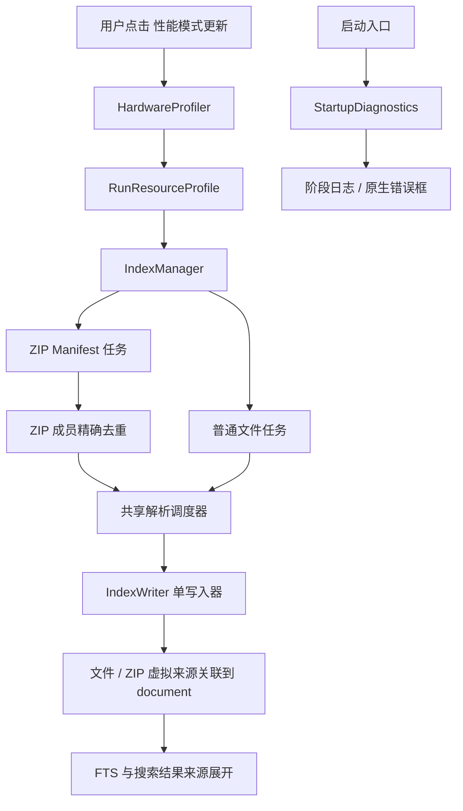
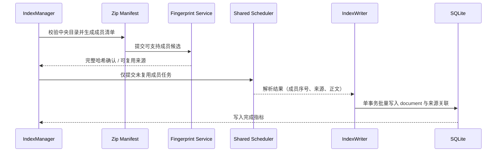

# LocalFullTextSearch 性能与启动诊断开发规格

| 字段 | 内容 |
|---|---|
| 状态 | 复核后待补齐；当前实现不得宣称已完成 |
| 优先级 | P0 首次添加交互、启动诊断与交付可用性；P1 手动性能模式、精确去重、ZIP 成员并发、大型 XLSX 读取优化 |
| 适用范围 | `everything-finder` / `LocalFullTextSearch` |
| 编写日期 | 2026-07-29 |
| 实施原则 | 先解决可诊断启动失败，再提升索引性能；任何优化不得牺牲内容完整性或搜索准确性 |

---

## 0. 2026-07-29 复核结论与未完成清单

本节记录基于真实界面、数据库状态和代码复核得到的结论。后续开发必须先以本节为准，避免把当前半成品误交付。

### 0.1 当前用户可见问题

1. 首次添加搜索范围后弹出“是否立即开始建立完整索引？”的模态框。该弹窗会打断用户，并且只有普通索引入口，用户如果点 `Yes` 就无法第一次直接进入 `性能模式更新`。
2. 索引任务运行中，`更新全部` 和 `性能模式更新` 均灰显。这一互斥逻辑本身合理，但首次添加后的弹窗会让用户误以为性能模式不可用于首次索引。
3. 失败页中 31 条 `ZIP member size changed during indexing` 不是 PDF 正文解析失败，而是 ZIP 成员抽取前的稳定性校验失败。当前错误码被统一映射成 `FILE_IN_USE`，提示不准确。
4. `202601 服务资质报表.xlsx` 文件本体约 25.6 MB，但内部解压后 XML 约 274 MB，其中最大工作表 XML 约 180 MB。当前 `xlsx_stream` 逐 sheet、逐 row 串行解析，准确但对超大 XLSX 进度感和耗时表现不足。

### 0.2 已实现但仍需验收的能力

| 能力 | 当前状态 | 待验收点 |
|---|---|---|
| 启动诊断 | 已有早期日志和原生错误框 | 需在冻结包、完整拷贝目录、缺文件、EDR/Defender 环境复核 |
| 一次性性能模式按钮 | 已有 `性能模式更新` 入口 | 首次添加后不能被弹窗绕开；普通 `更新全部` 不得复用性能配置 |
| 硬件探测资源配置 | 已有 CPU、内存、磁盘类型探测 | 需在 i7-1260P / 16 GB / SSD 和低配/网络盘/可移动盘验证 |
| 去重指标记录 | 已写入 `index_runs.summary_json` | 性能模式任务详情 UI 仍需展示关键指标 |
| 冻结包完整性校验 | 已有自动生成/校验脚本 | 不要求用户手工比对 `SHA256SUMS.txt` |

### 0.3 未完全实现或需修复的需求

| 编号 | 问题 | 影响 | 必须交付 |
|---|---|---|---|
| G1 | 首次添加搜索范围后弹窗自动询问是否立即索引 | 用户无法自然选择第一次使用性能模式 | 添加范围后不弹窗，仅刷新范围列表；用户自行点击 `更新全部` 或 `性能模式更新` |
| G2 | ZIP manifest 成员编号与抽取阶段使用的成员列表不一致 | 含目录项的 ZIP 会出现成员大小不一致误报 | manifest 与抽取必须使用同一套稳定 member key，不得用过滤后序号索引未过滤列表 |
| G3 | ZIP 成员错误码和用户提示过粗 | 失败页误导用户以为文件占用 | 区分 ZIP 目录变化、成员大小变化、成员内容变化、文件占用、权限失败 |
| G4 | ZIP 去重仍未完全遵守“候选先筛、最终 SHA 后复用”协议 | 大 ZIP 会产生不必要的完整哈希和读取成本 | 先用扩展名、大小、CRC、解析器版本筛候选，再只对候选补完整 SHA-256 |
| G5 | 性能任务详情未展示完整 `dedup_*` 指标 | 用户无法判断性能模式节省了多少解析 | 在任务条或详情区展示候选数、完整哈希数、复用来源数、避免解析数和避免字节数 |
| G6 | 大型 XLSX 缺少专门优化策略 | 单文件会长时间占用 Office 解析车道，进度解释不足 | 增加 XLSX 结构预扫描、细粒度进度、超大 sheet 策略和可验证性能基准 |
| G7 | 发布门禁容易被误解成用户手工 SHA 比对 | 增加使用者负担 | 完整性检查必须由打包流程自动执行；用户说明只保留排障用途 |

---

## 1. 目标、范围与非目标

### 1.1 目标

1. 用户主动点击一次性 `性能模式更新` 后，程序自动探测本机硬件并选择本次索引的资源配置。
2. 将 ZIP 内成员提升为可独立调度、可精确去重、可恢复的索引来源，消除单个大型 ZIP 串行解析的关键路径。
3. 在目录文件、ZIP 成员以及不同 ZIP 成员间复用完全相同内容的解析结果，保留所有实际来源的搜索命中。
4. 对新电脑首次运行时“完整拷贝应用目录但 EXE 长时间无窗口”的问题提供可见阶段、可读错误和可交付诊断日志。
5. 在目标设备（i7-1260P、16 GB RAM、SSD）上安全利用可用资源；同时对低配、机械盘、网络盘、U 盘自动降级。
6. 首次添加搜索范围后不自动弹出索引确认框，用户必须能在界面上自主选择 `更新全部` 或 `性能模式更新`。
7. 对超大 XLSX 提供可诊断、可验证的读取优化，避免单个工作簿长时间无细粒度进度。

### 1.2 强制约束

- 性能模式只能由用户点击按钮启动。禁止定时任务、空闲时间、键鼠检测、开机自动索引或文件变化自动索引。
- 普通 `更新全部` 不得使用性能模式的临时配置。
- 性能模式仅影响当前任务；完成、取消或重启后必须回到普通配置。
- 添加搜索范围只是配置动作，不得自动启动索引，不得弹出阻塞式“是否立即建立索引”确认框。
- 不得通过跳过大文件、缩短文本、仅索引文件名、降低 OCR 分辨率、降低 OCR 置信度或减少 ZIP 成员换取速度。
- 现有 ZIP 安全限制、OCR 语义、增量索引、失败记录、取消与恢复语义必须保留。
- 本文不要求 GPU OCR。当前交付的 Paddle OCR 为 CPU 路径，GPU 支持另立设计和兼容性验证。

### 1.3 非目标

- 不承诺将单个超大 DOCX/PPTX 的内部 XML 再次拆分为并行任务；本次先保证文件级和 ZIP 成员级并发。
- 不修改搜索排序、预览 UI、文件监控策略或 OCR 模型质量。
- 不试图由主程序捕获 Windows 在 Python 入口之前的安全软件拦截、SmartScreen 阻止或系统 DLL 装载失败。

---

## 2. 当前实现与问题依据

### 2.1 已具备的能力

| 能力 | 当前位置 | 备注 |
|---|---|---|
| 普通文件内容复用 | `core/index_manager.py::_prepare_jobs` | 按 `content_key + parser_name + parser_version` 分组，重复普通文件只解析一次 |
| 内容规范化与共享文档 | `documents`、`files`、`content_blocks` | 一个 `document` 可被多个 `files` 引用 |
| OOXML 流式解析 | `parsers/ooxml/*_stream_parser.py` | 已避免构建完整 Office 对象模型 |
| PDF 大文件并行入口 | `parsers/pdf_parser.py` | 现有能力需纳入全局资源约束 |
| 进程池与单写入器 | `core/index_manager.py`、`core/index_writer.py` | 解析可并行，SQLite 保持单写入路径 |
| 全量扫描延迟 FTS 构建 | `core/database.py` | 避免逐文件重建 FTS |
| OCR 延迟导入 | `ocr/ocr_engine.py` | Paddle 仅在实际 OCR 时加载 |

### 2.2 已确认的瓶颈

1. `ZipParser` 逐成员解压、解析和产出结果；单一大 ZIP 无法利用全局并发能力。
2. ZIP 成员没有独立来源记录，无法复用目录文件的规范 `document`，也无法在搜索中正确展开每一个 ZIP 内路径。
3. ZIP、OCR 和旧版 Office 车道的真实进程数未完整使用设置值。
4. 首次添加搜索范围后仍出现“是否立即开始建立完整索引？”的模态框，打断了用户自行选择索引方式的流程。
5. 当前 `xlsx_stream` 对超大工作簿只按 sheet / row 顺序流式读取，虽然准确，但缺少针对大 XML 体量的细粒度进度和专项加速策略。
6. 启动顺序先执行 `DatabaseManager.initialize()`，再创建 `QApplication` 和主窗口。旧数据库备份、迁移或 FTS 重建会造成无窗口等待。
7. 新用户首次运行没有旧数据库时，空库初始化应是秒级。若完整应用目录在本机首次启动超过 5 分钟，优先怀疑安全软件扫描、网络/同步目录运行、压缩包预览运行、文件缺失或 DLL 装载失败。

### 2.3 当前启动链路

```text
PyInstaller bootloader
  -> 顶层模块导入
  -> configure_logging()
  -> SettingsService.load()
  -> DatabaseManager.initialize()
  -> QApplication()
  -> MainWindow(...).show()
```

当前窗口出现前没有阶段日志和错误 UI。Paddle OCR 已延迟导入，因此正常情况下不是首次窗口出现前的主因。

---

## 3. 目标架构



### 3.1 模块职责

| 模块 | 职责 | 禁止承担的职责 |
|---|---|---|
| `core/hardware_profile.py` | 采集硬件与卷信息，计算不可变的本次运行配置 | 不读写 UI，不启动任务，不改变持久化设置 |
| `core/index_manager.py` | 全局资源调度、普通文件与 ZIP 成员任务编排 | 不创建嵌套进程池，不直接写 SQLite 正文 |
| `parsers/zip_parser.py` | 校验 ZIP、生成成员清单、读取指定成员 | 不自行创建 `ProcessPoolExecutor` |
| `core/content_fingerprint.py` | 候选指纹与完整 SHA-256 确认 | 不把 CRC、大小或抽样哈希当作最终相同依据 |
| `core/database.py` | 迁移、来源关联、规范文档与 FTS 重建 | 不承担解析调度 |
| `workers/scan_worker.py` | 承载一次索引任务与进度回传 | 不在后台自动触发索引 |
| `services/startup_diagnostics.py` | 启动阶段记录、异常归类、原生错误框 | 不掩盖异常或继续运行不完整应用 |
| `app.py` | 尽早启用启动诊断，延迟导入重量模块 | 不在窗口创建前静默执行无反馈长任务 |

---

## 4. 数据模型与迁移设计

### 4.1 设计决定：ZIP 成员使用 `files` 的虚拟来源记录

不引入与 `files` 平行、行为不同的第二套来源表。ZIP 成员应在现有 `files` 表中创建虚拟来源记录，以复用已有的 `documents` 共享、搜索展开、删除回收和 FTS 逻辑。

对 `files` 增加以下字段：

| 字段 | 类型 | 语义 |
|---|---|---|
| `source_kind` | `TEXT NOT NULL DEFAULT 'file'` | `file` 或 `zip_member` |
| `container_file_id` | `INTEGER NULL` | ZIP 成员对应的外层 ZIP 文件 ID |
| `internal_path` | `TEXT NULL` | ZIP 内规范化相对路径 |
| `member_order` | `INTEGER NULL` | ZIP 中央目录的稳定成员序号 |
| `member_crc32` | `INTEGER NULL` | 仅作为候选筛选依据 |
| `member_uncompressed_size` | `INTEGER NULL` | ZIP 成员未压缩大小 |
| `content_hash_full` | `TEXT NULL` | 完整 SHA-256，作为精确复用依据 |

虚拟来源路径采用不可与本地路径冲突的内部格式，例如：

```text
zip://<outer-file-id>/<percent-encoded-internal-path>
```

UI 显示和搜索结果使用外层物理路径加 ` > ` 内部路径，例如：

```text
E:\资料\archive.zip > reports\2024\report.docx
```

### 4.2 唯一性与索引

必须建立以下约束或等效索引：

```sql
CREATE UNIQUE INDEX IF NOT EXISTS idx_files_zip_member_source
ON files(container_file_id, internal_path)
WHERE source_kind = 'zip_member' AND is_deleted = 0;

CREATE INDEX IF NOT EXISTS idx_files_source_kind
ON files(source_kind, container_file_id, is_deleted);

CREATE INDEX IF NOT EXISTS idx_files_content_hash_full
ON files(content_hash_full);
```

现有 `path` 唯一约束继续生效，虚拟路径必须稳定，保证增量扫描不会重复插入成员。

### 4.3 删除与增量一致性

- 外层 ZIP 未出现在本轮扫描结果中时，必须同时标记其所有 `zip_member` 虚拟来源删除。
- ZIP 内容发生变化时，先比对新成员 manifest，再删除不存在成员、更新变更成员、保留未变化成员。
- 普通扫描的 `previous_paths - seen_paths` 删除逻辑不得把虚拟 ZIP 成员误判为根目录中缺失的普通文件。
- 删除一个来源前必须沿用现有规范文档重分配与垃圾回收语义：只有没有活跃来源的 `document` 才可删除。

### 4.4 迁移要求

1. 提升 `SCHEMA_VERSION`，数据库升级前按现有策略创建一次可恢复备份。
2. 迁移必须幂等，可重复执行，不要求用户重建已有普通文件索引。
3. 旧 ZIP 索引结果因无法恢复成员级来源，需要在首次性能模式或下一次 ZIP 增量扫描时重建对应 ZIP，不强制重建全部非 ZIP 文件。
4. 迁移、FTS 重建和任何长操作必须通过启动诊断报告阶段，禁止无窗口静默执行。

---

## 5. 精确重复内容复用

### 5.1 复用范围

必须支持以下组合：

1. 普通文件 <-> 普通文件。
2. ZIP 成员 <-> 同一 ZIP 的其他成员。
3. ZIP 成员 <-> 不同 ZIP 的成员。
4. ZIP 成员 <-> 根目录下的普通文件。

复用后每一个来源仍独立出现在搜索、预览定位、导出和失败清单中。

### 5.2 判定协议

```text
候选键 = parser_name + parser_version + extension + raw_size + crc32(仅 ZIP 成员可用)
最终键 = sha256:<原始字节流完整 SHA-256>
```

规则：

- 候选键只用于减少完整哈希次数，永远不能用于直接复用。
- 只有最终键相同，且 `parser_name`、`parser_version`、OCR 相关配置版本相同，才可链接同一 `document`。
- 大普通文件的抽样哈希只用于现有变更检测；一旦成为 ZIP 复用候选，必须补算完整 SHA-256。
- 一个候选组尚无完成 `document` 时，选择一个来源作为规范解析任务；其他来源等待最终哈希确认后关联。
- 相同文件在不同解析器版本或不同 OCR 配置下必须重新解析，不得复用旧正文。

### 5.3 运行指标

每次索引运行必须记录：

- `dedup_candidate_count`
- `dedup_full_hash_count`
- `dedup_verified_source_count`
- `dedup_parse_avoided_count`
- `dedup_bytes_avoided`

这些指标显示在性能模式任务详情，并写入 `index_runs.summary_json`。

---

## 6. ZIP 成员级并发设计

### 6.1 工作流



### 6.2 任务模型

新增不可变任务描述符 `ZipMemberJob`，至少包含：

```python
archive_file_id: int
archive_path: Path
member_index: int
member_name: str
member_size: int
member_crc32: int
parser_name: str
parser_version: str
source_file_id: int
content_key: str | None
```

约束：

- 任务只传递描述符，不传递已经打开的 `ZipFile`、文件流或可变解析器实例。
- 每个 worker 独立打开 ZIP 并读取目标成员。
- 不允许在 `ZipParser` 内部创建嵌套 `ProcessPoolExecutor`。
- ZIP 成员与普通文件、PDF 页级并发、OCR 任务共享同一个全局资源令牌。

### 6.3 顺序、状态与取消

- `member_index` 是中央目录中的稳定顺序，用于进度、定位和批量写入排序。
- 结果写入不依赖完成顺序；写入器按 `(archive_file_id, member_index)` 稳定处理。
- 成员级状态必须是 `success`、`partial_success`、`failed`、`password_protected`、`unsupported`、`metadata_only` 或明确的待恢复状态。
- 取消后已提交事务的成员保留成功状态；未开始或未完成成员保持待处理，可在下一次扫描恢复。
- 继续沿用 ZIP 的最大成员数、最大解压尺寸、最大嵌套深度、路径穿越和加密成员保护。

---

## 7. 资源配置与调度

### 7.1 配置对象

新增只读 `RunResourceProfile`。它是本次任务的快照，不写回 `AppSettings`。

```python
@dataclass(frozen=True, slots=True)
class RunResourceProfile:
    mode: Literal['normal', 'performance']
    logical_cpus: int
    physical_cores: int | None
    memory_budget_mb: int
    cpu_token_budget: int
    normal_workers: int
    office_workers: int
    zip_member_workers: int
    ocr_workers: int
    ocr_cpu_threads: int
    legacy_office_workers: int
    db_write_batch_blocks: int
    db_write_batch_bytes: int
    disk_class: Literal['ssd', 'hdd', 'network', 'removable', 'unknown']
```

### 7.2 i7-1260P / 16 GB SSD 的性能模式基线

| 参数 | 建议值 | 规则 |
|---|---:|---|
| `cpu_token_budget` | 14 | 保留约 2 个逻辑线程给操作系统与 UI |
| `memory_budget_mb` | 8192 | 不得超过物理内存的 50% |
| `normal_workers` | 6 | 受 CPU 令牌与 I/O 介质限制 |
| `office_workers` | 3 | OOXML 与原生 PDF 共用 |
| `zip_member_workers` | 3 | ZIP 成员与所有车道共享令牌 |
| `ocr_workers` | 2 | 仅在可用内存充足时启用 |
| `ocr_cpu_threads` | 2 | 必须计入 CPU 令牌 |
| `legacy_office_workers` | 1 | 限制外部转换器竞争 |

运行时必须根据可用内存、盘类型、网络路径和 CPU 数量下调，不得上调超过全局上限。网络盘、可移动盘、机械盘默认使用保守并发。

### 7.3 调度不变量

1. 已提交任务的 CPU 令牌之和不得大于 `cpu_token_budget`。
2. 已提交任务估算内存之和不得大于 `memory_budget_mb`。
3. OCR 进程内部线程、PDF 页级任务、ZIP 成员任务均必须计入同一资源模型。
4. SQLite 仍由 `IndexWriter` 单写入器写入；解析 worker 不得持有数据库写连接。
5. 进程池回收阈值必须依据真实内存/稳定性基准调整，不能为追求并发频繁重启 Windows spawn 子进程。

---

## 8. 其他解析优化

### 8.1 本次实现范围

| 类型 | 要求 |
|---|---|
| TXT/LOG/CSV/MD/JSON/XML/INI | 保持流式读取；优化小文件提交与批量写入；支持精确内容复用 |
| DOCX/PPTX | 继续默认使用流式解析；利用文件级并发、ZIP 成员级并发与内容复用 |
| XLSX 大工作簿 | 在保持准确性的前提下优化共享字符串、sheet 预扫描、单 sheet 进度和恢复能力 |
| 原生 PDF | 每页优先提取原生文字；仅对无有效文字或需要补充的页面进入 OCR，不得整份原生 PDF 因 OCR 配置被串行化 |
| 图片与扫描 PDF | 相同原始字节只 OCR 一次；不得改变当前模型、检测边长或置信度语义 |
| 旧版 Office | 继续使用转换缓存；限制单任务以保证稳定性 |
| SQLite/FTS | 根据 `RunResourceProfile` 调整批量大小；全量扫描保持最后统一构建 FTS |

### 8.2 明确延后

- 单超大 DOCX/PPTX 的 XML 分段并发。
- GPU OCR。

### 8.3 大型 XLSX 专项要求

超大 XLSX 不再视为“明确定义的延期项”，而是本次必须补齐的性能项。要求如下：

1. 仍保持完整准确性，不得跳过公式、共享字符串、批注、空单元格、隐藏行列或评论。
2. 需要提供 workbook 级预扫描，提前展示 sheet 数、最大 sheet 体量和预估耗时区间。
3. 需要提供 sheet 级与 row 级进度，使长任务不再表现为“长时间无变化”。
4. 可以继续采用流式解析，但必须补充针对超大共享字符串表、超大 sheet XML 和恢复点的优化。
5. 对单个超大 XLSX 的优化不得以牺牲 ZIP 成员并发、全文准确性或失败可诊断性为代价。
6. 必须以当前真实文件建立基准，包括 `202601 服务资质报表.xlsx` 这类 25 MB 级输入和更大文件样本。

这些优化需要额外验证文本顺序、共享字符串、公式、批注、页眉页脚、幻灯片备注和硬件兼容性，但不再允许长期停留在“完全延后”状态。

---

## 9. 启动诊断与错误提示

### 9.1 诊断目标

在 Python 入口可执行的前提下，用户不应再遇到“点击 EXE 后长时间没有任何窗口、没有错误信息、没有日志”的情况。

### 9.2 入口改造

`app.py` 必须将重量模块导入移动到启动诊断初始化之后。最小启动顺序：

```text
标准库与 ctypes
  -> StartupDiagnostics.begin()
  -> 安装 sys.excepthook / threading.excepthook / faulthandler
  -> 记录 Python 入口已到达
  -> 延迟导入项目模块和 Qt
  -> 读取设置
  -> 初始化数据库
  -> 创建 QApplication 和主窗口
  -> 标记主窗口已显示
```

### 9.3 `StartupDiagnostics` 接口

新增 `services/startup_diagnostics.py`：

```python
class StartupDiagnostics:
    def begin(self) -> None: ...
    def stage_started(self, name: str) -> None: ...
    def stage_completed(self, name: str) -> None: ...
    def stage_failed(self, name: str, exc: BaseException) -> None: ...
    def mark_window_visible(self) -> None: ...
    def show_native_error(self, title: str, message: str) -> None: ...
```

要求：

- 日志首选 `%LOCALAPPDATA%\\LocalFullTextSearch\\logs\\startup.log`，无法写入时回退至 `%TEMP%`，并在错误框中说明实际路径。
- 每条阶段记录包含开始时间、结束时间、耗时、EXE 路径、工作目录、冻结状态、Windows 版本、应用版本、设置路径、数据库路径。
- 未处理异常记录完整 traceback；错误框只展示用户可理解的摘要、失败阶段与日志路径。
- 使用 `ctypes.windll.user32.MessageBoxW` 显示窗口前的原生错误框，不能依赖 Qt 已成功加载。
- 若主窗口尚未显示且阶段持续超过 15 秒，显示非终止性的“启动仍在进行”诊断提示，包含当前阶段和日志路径。此机制仅用于可见性，不会启动、暂停或调度任何索引任务。
- 下次启动读取上次启动状态；若上次没有 `window_visible` 记录，显示“上次启动未完成”的摘要与日志路径。

### 9.4 错误分类

| 类别 | 用户提示 | 日志必须包含 |
|---|---|---|
| 应用目录不完整 / 关键模块缺失 | 请确认完整应用文件夹未被拆分或隔离 | 缺失模块、EXE 路径、导入 traceback |
| 用户数据目录不可写 | 请检查 `%LOCALAPPDATA%` 写入权限 | 路径、WinError、回退日志路径 |
| 数据库锁定、损坏或迁移失败 | 请关闭其他实例或联系支持人员并提供日志 | 数据库路径、SQLite 错误、schema 版本、阶段耗时 |
| Qt/DLL 加载失败 | 请检查安全软件隔离和系统运行库 | 原始 ImportError/OSError、进程环境 |
| 未知启动异常 | 启动失败，请提供诊断日志 | 完整 traceback 和最后阶段 |

### 9.5 系统级拦截边界

下列场景中主程序可能没有机会运行，因而无法生成 `startup.log` 或弹框：

- Defender、企业 EDR 或 SmartScreen 在 bootloader 前拦截；
- Windows DLL loader 在 Python 入口前失败；
- 可执行文件被隔离、删除或权限禁止执行。

交付说明必须要求用户检查 Windows 保护历史记录、企业安全软件记录和事件查看器，并确认：

1. 分发并运行完整 `onedir` 文件夹，不能只复制 EXE。
2. 先解压至本机 SSD 普通目录，不能在压缩包预览、网络共享、网盘同步目录或 U 盘直接运行。
3. 下载文件/压缩包属性存在“解除锁定”时先解除锁定。

---

## 10. 分阶段实施计划

### Phase 0：基线与启动复现

**目标**：得到真实启动和索引基线，确认启动故障所在层级。

- 在干净 Windows 用户账户、i7-1260P/16 GB SSD、网络盘、U 盘环境分别记录启动耗时。
- 采集完整目录大小、文件数、Defender/EDR 占用、`startup.log` 是否生成。
- 增加不修改业务数据的性能基准脚本，记录扫描、指纹、去重、各解析车道、写库、FTS 的耗时。

**完成条件**：每一环境都能判断“未进入 Python / 导入失败 / 数据库初始化慢 / Qt 创建慢 / 主窗口构建慢”中的准确阶段。

### Phase 1：P0 启动诊断

**涉及文件**：`app.py`、`services/startup_diagnostics.py`、`services/logging_service.py`、启动测试。

- 实现早期诊断日志、阶段记录、原生错误框和上次失败摘要。
- 将窗口前的项目重量导入改为延迟导入。
- 为设置读取、数据库初始化、Qt 导入和主窗口构造提供可识别阶段。
- 更新交付 README，写明完整目录分发和安全软件排查步骤。

**完成条件**：Python 入口后的任意启动异常均有错误框和日志；干净本机 SSD 环境窗口在 5 秒内可用；超过 15 秒可看到当前阶段。

### Phase 2：硬件配置与一次性性能模式

**涉及文件**：`core/hardware_profile.py`、`config/defaults.py`、`ui/main_window.py`、`workers/scan_worker.py`、`core/index_manager.py`、测试。

- 增加硬件与卷探测、不可变 `RunResourceProfile` 和全局资源令牌。
- 增加 `性能模式更新` 信号，仅构造本次 worker 的性能配置快照。
- 首次添加搜索范围后不得弹出阻塞式确认框；添加只是完成范围登记，具体索引方式交给用户在索引管理页选择。
- 兑现 OCR、ZIP、旧版 Office 和 Office 进程车道的实际并发设置。
- 在 UI 和 `index_runs.summary_json` 中记录实际生效配置。

**完成条件**：普通模式不变；性能模式配置随机器和索引盘变化；任何车道组合不超过 CPU/内存预算。

### Phase 3：ZIP 虚拟来源与精确去重

**涉及文件**：`core/database.py`、`core/content_fingerprint.py`、`core/index_manager.py`、`parsers/zip_parser.py`、`core/search_engine.py`、迁移测试。

- 完成 `files` 虚拟来源字段与迁移。
- 实现普通文件和 ZIP 成员的候选筛选、完整 SHA-256 确认和规范文档复用。
- 修复 ZIP 成员的增量同步、删除传播、FTS 重建与搜索来源展开。
- 保存去重指标。
- 修正 ZIP 成员编号与抽取阶段的稳定对应关系，避免目录项过滤后引发成员错位。

**完成条件**：同内容目录文件、同/不同 ZIP 成员只解析一次，所有来源均可单独命中并正确清理。

### Phase 4：ZIP 成员级调度与 PDF 分流

**涉及文件**：`parsers/zip_parser.py`、`core/index_manager.py`、`parsers/pdf_parser.py`、`core/index_writer.py`、调度测试。

- 生成 ZIP manifest 和 `ZipMemberJob`。
- 将未复用成员提交给共享全局调度器，禁止嵌套进程池。
- 实现成员级取消、恢复、顺序写入和状态记录。
- 原生 PDF 与扫描/OCR 页面分流，并计入统一资源预算。
- 失败页错误要可读，必须区分“成员大小变化”“成员内容变化”“目录结构变化”“权限不足”和“文件占用”。

**完成条件**：一个大型 ZIP 内成员可并行，普通文件不被堵塞，所有安全限制和搜索定位保持正确。

### Phase 5：基准、冻结包与团队验收

- 在开发环境和冻结 EXE 中运行完整测试矩阵。
- 对普通模式与性能模式使用相同语料比对文件数、正文块、错误清单、搜索命中与索引耗时。
- 生成完整交付目录 SHA-256 清单与启动诊断指引。
- 在至少一台有 Defender/EDR 的干净电脑上验证首次启动。
- 验证首次添加范围后的非弹窗交互。
- 验证大 XLSX 的细粒度进度和性能改善。

---

## 11. 测试矩阵与验收门禁

### 11.1 自动化测试

- 硬件探测失败、低内存、网络盘、机械盘、可移动盘的资源配置回退。
- 性能模式仅由按钮启动，普通 `更新全部` 不读取性能配置。
- 首次添加搜索范围只刷新界面，不弹出阻塞确认框，不自动启动索引。
- CPU/内存令牌在正常、OCR、ZIP、Office、PDF 混合负载下不超额。
- 普通文件 <-> 普通文件、ZIP 成员 <-> ZIP 成员、ZIP 成员 <-> 普通文件的精确去重。
- 抽样哈希相同或 CRC 相同但完整 SHA-256 不同的文件不得复用。
- ZIP 成员稳定抽取必须覆盖带目录项、重复文件名、重复内容和嵌套目录的真实样本。
- ZIP 增量变更、成员删除、外层 ZIP 删除、取消恢复和进程崩溃恢复。
- 原生 PDF、混合 PDF、纯扫描 PDF 的文字与 OCR 覆盖。
- 超大 XLSX 的工作簿预扫描、sheet 级进度和恢复点。
- 启动阶段日志、错误分类、数据库初始化失败、无写权限、缺模块、未处理异常和上次失败提示。

### 11.2 手工测试

- i7-1260P / 16 GB / SSD 设备上的普通模式与性能模式对比。
- 含大 ZIP、重复目录文件、重复 ZIP 成员、OCR 图片和原生 PDF 的真实语料。
- 从完整本地目录、下载目录、网络共享、网盘同步目录、U 盘、压缩包预览分别启动。
- Defender 或企业 EDR 环境中的首次启动。

### 11.3 发布门禁

只有同时满足以下条件才能发布：

1. 全部自动化测试通过，包含新迁移和冻结包测试。
2. 普通模式与性能模式的内容集合、失败集合、搜索命中集合一致。
3. 性能模式在目标语料上不出现总耗时回退；若回退，必须记录原因并禁止推荐该配置。
4. Python 入口后的启动失败可显示错误框，并生成可定位的 `startup.log`。
5. 完整应用目录、SHA-256 清单、分发说明、启动诊断指南和回滚说明齐全，且校验由构建/打包流程自动执行，不要求用户手工比对。

---

## 12. Codex 实施规则

- 每个 Phase 必须先补充/更新测试，再修改实现；不得把多个 Phase 的数据库迁移和调度重构混在一个不可验证提交中。
- 所有 schema 变更必须提供迁移、回归、删除传播和 FTS 重建测试。
- 所有并发改动必须验证取消、异常、进程回收、SQLite 单写入和内存预算。
- 所有性能结论必须基于同一语料、同一设置、同一设备的可重复基准，不能只以单次 ETA 或少量小文件为依据。
- 遇到“无法打开 EXE”问题，首先依据 `startup.log` 是否存在判断是否已进入 Python；未进入 Python 时不得宣称是应用逻辑错误。
- 未经用户再次确认，不得将性能模式改为自动、定时、空闲触发或持久化常驻模式。
