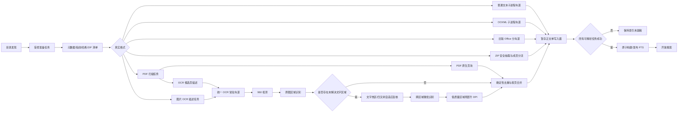
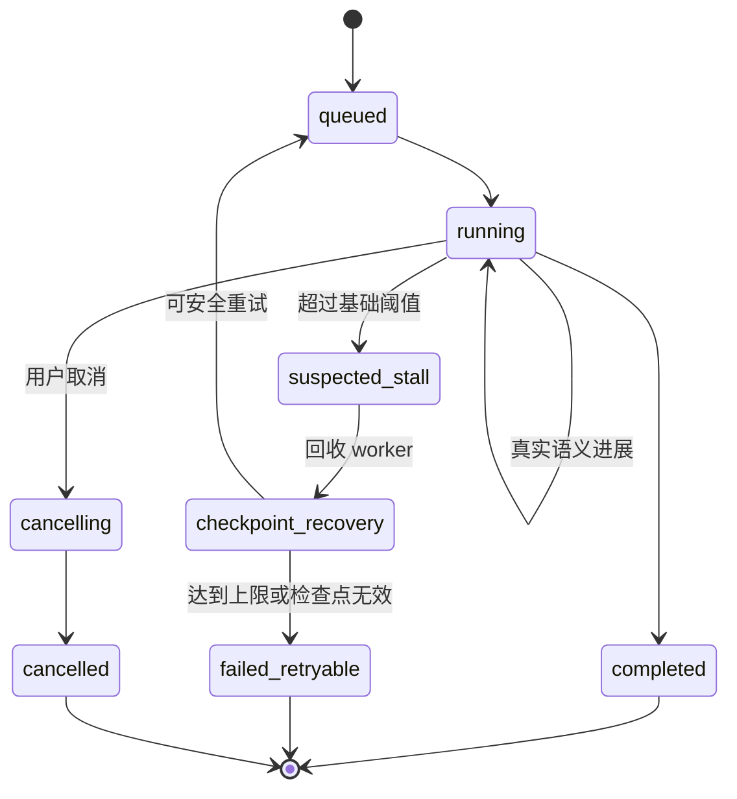
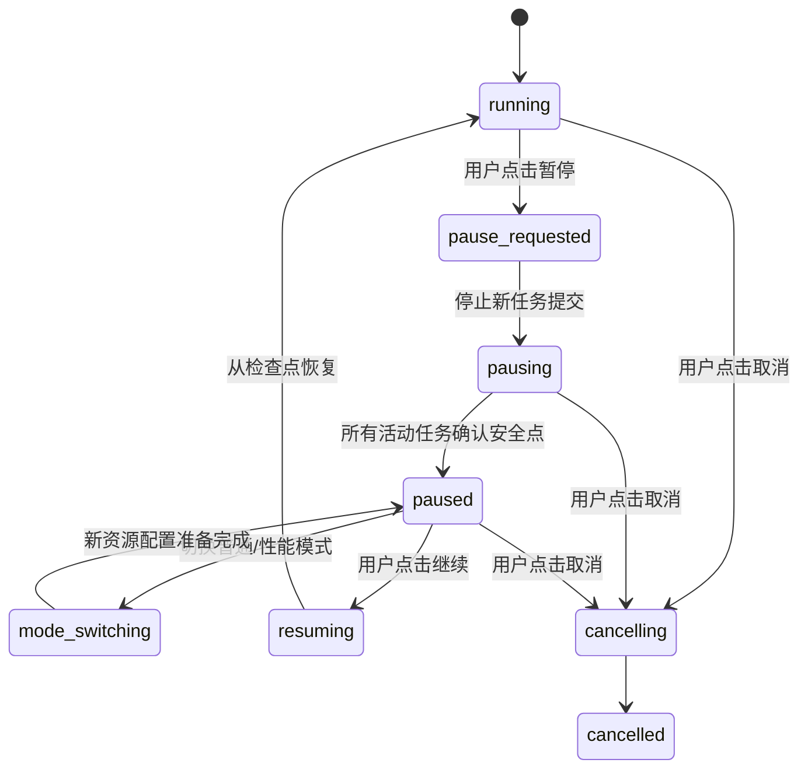

# LocalFullTextSearch 解析卡滞治理与首次全量索引二期优化开发需求

| 字段 | 内容 |
|---|---|
| 文档状态 | 待开发 |
| 编写日期 | 2026-07-30 |
| 当前应用基线 | `LocalFullTextSearch 1.2.1` |
| 前置需求 | `docs/首次全量索引性能优化与未完成项开发需求.md` |
| 目标项目 | `everything-finder` / `LocalFullTextSearch` |
| 主要目标 | 消除可无限卡滞的执行边界，并在不降低解析完整性、OCR 精度和搜索准确性的前提下继续缩短第一次完整索引时间 |
| 适用执行者 | Codex 开发代理 |

> 本文是对当前 `1.2.1` 实现的二期增量开发规格。实施时必须以实际代码和基准数据为准，不得仅新增接口、配置项、日志或模拟测试后宣称完成。

---

## 0. Codex 强制执行指令

1. 开发前先冻结当前 `1.2.1` 源码、设置、测试语料和性能基线。必须记录 Git 提交、工作区状态、Python/依赖版本、硬件、磁盘类型和缓存状态。
2. 每个阶段必须遵循“先补失败测试或验证工具，再修改实现，再运行阶段验证”的顺序。上一阶段未通过，不得进入下一阶段。
3. 不允许通过以下方式换取速度：
   - 跳过可解析文件；
   - 把失败文件当作成功；
   - 截断正文、页数、工作表、ZIP 成员或 OCR 区域；
   - 降低 OCR 检测范围、识别分辨率或置信度要求；
   - 只索引文件名和路径；
   - 提前开放不完整索引；
   - 静默吞掉密码、损坏、转换失败或无进展错误。
4. 视频不做内容解析，不做 OCR、抽帧、音频转写或字幕解析。视频只登记文件名、路径和基础元数据，并计入“排除视频”。
5. 不建立“长文件后台慢任务队列”。所有可解析文件都必须属于当前完整索引批次；只有全部可解析文件成功且 FTS 原子发布完成后，搜索入口才可用。
6. 禁止恢复固定的“单文件总耗时上限”。只允许基于真实语义进展的无进展超时。
7. 普通模式与性能模式必须生成相同的正文和搜索结果；两种模式只允许并发度、批大小和资源预算不同。
8. 所有性能结论必须来自修改前后同设备、同语料、同设置、同缓存条件下的至少 3 次运行，并报告中位数。只给单次最好成绩不算完成。
9. 开发完成后必须验证源码和冻结版 EXE，重新生成发行目录与 ZIP，并检查没有残留解析进程。
10. 如果第三方 OCR、Office/WPS、LibreOffice、文件系统或硬件限制导致目标未达成，必须保留正确性并提供证据，不得用降级精度掩盖问题。

---

## 1. 已确认的产品边界

### 1.1 完整索引门槛

- 第一次完整索引期间不可搜索。
- 更新导致正文版本变化时，更新批次完成前不可发布混合版本索引。
- 只有以下条件全部满足时，搜索入口才可用：
  1. 所有可解析文件均为 `success`；
  2. 没有 `processing`、`pending`、`failed_retryable`、`failed`、`partial_success`、`converter_missing` 或 `ocr_disabled`；
  3. 所有父任务和页级/区域级子任务均已完成；
  4. FTS 已从完整暂存正文原子发布；
  5. 数据库完整性检查通过；
  6. 没有仍在运行的解析 worker、Office/WPS/LibreOffice 子进程。
- 检查点、页级结果和 OCR 缓存可用于恢复，但在整轮成功前不得进入用户可搜索的正式 FTS。

### 1.2 准确性边界

- 保留现有“960 像素检测 + 原图文字区域识别 + 低质量时原图分块”原则。
- 二期优化可以改变任务粒度、渲染顺序、分块规划和推理批次，但不得减少应该进入 OCR 的页面或文字区域。
- 近似哈希、感知哈希、图像相似度只能用于发现候选，不能单独作为跳过 OCR 的依据。
- 只有经过确定性验证的完全相同输入，才允许复用 OCR 结果。
- 已确认的关键检索词，例如“拔掉 3 个传感器”，在优化前能命中的文件、页码和上下文，优化后必须继续命中。

### 1.3 取消、暂停与失败

- “取消”可以终止当前批次；已确认检查点保留，未确认临时正文不得发布。
- “暂停”只能在安全边界生效，不能使用 Windows 线程强制挂起。
- 无法自动恢复的单文件失败必须明确显示并阻止完整索引发布，不能跳过后继续宣布完整索引成功。
- 失败后允许用户修复环境或文件并继续，但必须从安全检查点恢复，不能重复已确认的长任务区间。

---

## 2. 当前实现复核结论与真实瓶颈

### 2.1 当前无进展保护

当前实现已经具备：

- PDF、OOXML、OCR、ZIP 和旧版 Office 使用独立子进程车道；
- 独立 watchdog 线程约每 0.25 秒检查一次进程任务；
- worker 通过进度文件上报阶段、完成量、总量、游标和进度序号；
- 无进展后终止进程池、清理 Office 子进程、重建 worker 并尝试从检查点恢复；
- 默认无进展阈值：

| 车道/阶段 | 当前默认阈值 |
|---|---:|
| 普通解析 | 300 秒 |
| PDF/OOXML 进程解析 | 300 秒 |
| OCR | 900 秒 |
| ZIP | 900 秒 |
| 旧版 Office | 1800 秒 |

### 2.2 当前仍可能卡滞的边界

以下缺口必须在本轮解决：

1. `normal` 车道仍使用 `ThreadPoolExecutor`，watchdog 只处理 `ProcessPoolExecutor`。TXT、CSV、XML、JSON、日志等任务如果卡在磁盘或系统调用中，理论上可永久占用线程。
2. 文件发现、目录枚举、`stat`、指纹计算、完整哈希、ZIP manifest 和部分 ZIP 成员预抽取仍有同步运行在主调度路径中的部分，故障网络盘或异常文件系统可能使整轮调度无法前进。
3. 当前每次收到进度回调都会增加 `progress_sequence`。如果解析器重复上报相同阶段和相同完成量，可能错误刷新无进展时钟。
4. 当前重试阈值按 `1、2、4、4` 倍扩张。完全无进展时，OCR/ZIP 可能等待约 165 分钟，旧版 Office 可能等待约 330 分钟，用户会认为程序已经卡死。
5. 现有测试覆盖阈值选择和进度文件读取，但缺少“真实子进程永久阻塞—watchdog 回收—进程池重建—后续文件继续”的端到端验证。
6. UI 展示的“当前文件”可能只是所有并行任务中运行最久的任务。即使其他车道仍在前进，界面也可能长时间显示同一文件，造成假卡滞观感。

### 2.3 真实目录数据

测试根目录：

`E:\MRCODE\化免\免疫资料`

最近一次 `1.2.1` 运行数据：

| 指标 | 数据 |
|---|---:|
| 发现文件 | 331 |
| 可解析文件 | 309 |
| 排除视频 | 22 |
| 发现总字节 | 18,478,657,826 |
| 实际完成时间 | 1,063.740 秒（17 分 43.740 秒） |
| 扫描 | 0.615 秒 |
| 指纹准备 | 9.010 秒 |
| 数据库写入 | 9.125 秒 |
| PDF 解析累计 | 1,039.433 秒 |
| 图片 OCR 累计 | 548.887 秒 |
| 旧版 Word 累计 | 41.154 秒 |
| 旧版 PowerPoint 累计 | 22.755 秒 |
| XLSX 累计 | 4.050 秒 |

该次运行属于增量重解析，不是严格的全新数据库冷索引，因此不能直接作为最终首次全量耗时结论；但它足以证明当前主要瓶颈在 PDF/OCR，而不是目录扫描、哈希、XLSX 或数据库写入。

重点慢文件：

| 文件 | 耗时 | 关键特征 |
|---|---:|---|
| `CL-8000i液路图.pdf` | 371.255 秒 | 单页 13,837×9,637 像素，触发 117 个固定网格 OCR 分块 |
| `微信图片_20260421082834_33_45.jpg` | 250.285 秒 | 3,072×4,096，12 个分块 |
| `微信图片_20260421082832_32_45.jpg` | 233.457 秒 | 3,072×4,096，12 个分块 |
| `CL-2600i 系列仪器场景化维护指南_V1.0_CH.pdf` | 221.739 秒 | 109 个原生页块、22 个 OCR 页块 |

### 2.4 优化方向结论

- 扫描、指纹和数据库合计只占十几秒，不再作为二期主攻方向。
- PDF 当前按“整文件”占用唯一 `office_process` worker；一个超慢 OCR 页会阻塞后续所有 PDF/OOXML。
- OCR 低质量回退后使用完整固定网格；已识别区域、空白区域和重复覆盖区域仍可能再次检测和识别。
- OCR 识别虽已在单图内部按 16 个区域批处理，但没有跨分块、跨页面的统一批处理。
- PDF OCR 固定以 200 DPI 渲染整页；没有“低分辨率发现、高分辨率局部识别、低质量局部升级”的渲染流水线。
- 当前 `enable_mkldnn=False`，尚未用真实语料验证同模型的更快 CPU 推理后端。

---

## 3. 本轮开发范围

| 编号 | 优先级 | 需求 | 完成定义 |
|---|---|---|---|
| S0-01 | P0 | 全执行链可回收 | 普通文本、发现后准备、哈希、ZIP manifest 等可能长期阻塞的操作都有可终止边界 |
| S0-02 | P0 | 严格语义进展 | 重复心跳、重复阶段、相同游标和相同完成量不刷新无进展时钟 |
| S0-03 | P0 | 假死端到端恢复 | 真实挂起 worker 会被回收，进程池重建，其他文件继续，无残留进程 |
| S0-04 | P0 | 合理重试策略 | 不使用总耗时上限，也不因盲目指数退避让同一确定性卡点等待数小时 |
| P0-01 | P0 | PDF 页级任务图 | 原生页提取、OCR 候选发现、OCR 页识别和最终合并拆成持久化子任务 |
| P0-02 | P0 | 统一 OCR 常驻车道 | 图片和 PDF OCR 页共享受控 OCR worker，支持页级并行和全局资源核算 |
| P0-03 | P0 | OCR 自适应分块 2.0 | 用文字热区和未解决区域驱动分块，不再对低质量大图无条件铺满固定网格 |
| P0-04 | P0 | 跨分块/跨页批处理 | 检测和识别请求形成受控微批次，减少大量小调用 |
| P0-05 | P0 | 动态 PDF DPI | 低成本发现，按原图区域识别，低质量区域局部升分辨率 |
| P0-06 | P0 | 页图/区域精确去重 | 完全相同的页面、嵌入图片和裁剪区域只 OCR 一次 |
| P1-01 | P1 | 推理后端 A/B | 比较当前 Paddle、MKL-DNN、ONNX Runtime/OpenVINO，只有通过准确性门禁的更快后端才可启用 |
| P1-02 | P1 | 自适应资源调度 | 根据 CPU、RSS、队列和磁盘状态，在安全预算内动态选择 PDF/OCR 并发 |
| P1-03 | P1 | 卡滞与关键路径 UI | 显示真实活动车道、语义进展、距上次进展、重试和回收状态，避免假卡滞 |
| P1-04 | P1 | 冷索引基准与发行闭环 | 真实目录三次冷索引、正确性对比、冻结版验证、重新打包全部通过 |
| U0-01 | P0 | OCR 状态两行布局 | 模式/总体进度与当前文件/OCR 细节分行展示，在 1280×800、100%～150% 缩放下不截断关键状态 |
| U0-02 | P0 | 单值稳定 ETA | 样本不足显示“正在估算…”，稳定后只显示一个预计剩余时间，暂停时冻结 |
| U0-03 | P0 | 真正的安全暂停 | 停止提交新任务，活动任务在页/区域/检查点边界确认暂停，进入“已暂停”后资源接近空闲 |
| U0-04 | P0 | 暂停态切换运行模式 | 仅在真正“已暂停”后允许普通/性能模式双向切换，已完成工作不重做，长任务从检查点继续 |

### 3.1 非本轮范围

- 视频正文解析、字幕解析、抽帧 OCR 和音频转写；
- 云端 OCR 或依赖互联网的解析；
- 搜索未完成索引；
- 用 GPU 作为必须条件；
- 用感知哈希直接复用非完全相同图片的 OCR；
- 重新设计搜索排序、搜索语法或结果卡片；
- 与本轮目标无关的大规模 UI 改版。

---

## 4. 目标架构



### 4.1 任务层级

任务至少分为：

1. `root_scan`：目录枚举；
2. `source_prepare`：元数据、指纹、哈希和 spool；
3. `file_parse`：普通文件解析；
4. `pdf_scan`：页数、原生正文和 OCR 候选发现；
5. `pdf_page_ocr`：单页或小页批 OCR；
6. `image_ocr`：独立图片 OCR；
7. `ocr_region_batch`：区域级微批识别；
8. `document_merge`：按文件、页码和块序合并；
9. `index_write`：暂存正文写入；
10. `fts_publish`：完整批次原子发布。

每个子任务必须关联：

- `run_id`；
- `root_id`；
- `parent_task_id`；
- `file_id`；
- 内容指纹；
- 解析器及版本；
- 任务类型和车道；
- 页/成员/区域范围；
- 状态；
- 尝试次数；
- 最后语义进展；
- 检查点；
- worker PID；
- 错误码和错误详情。

---

## 5. S0：解析卡滞治理

### 5.1 统一可终止执行边界

#### 5.1.1 普通文本

- `normal` 车道不得继续依赖无法安全终止的线程解析。
- TXT、LOG、CSV、MD、JSON、XML、INI 等进入轻量子进程池。
- 子进程必须按读取字节或行区间上报语义进展。
- 大文本保持流式读取，不允许为实现进程隔离而一次性加载整文件。
- 进程结果继续使用受控 spool，避免在 IPC 中传输超大正文。

#### 5.1.2 文件发现与准备

- 目录枚举不能让 UI/主调度线程直接阻塞在单个目录系统调用上。
- 本地磁盘和网络/同步盘必须区分执行策略：
  - 本地盘允许小批量并发；
  - 网络盘、同步盘、U 盘采用较低并发；
  - 每个根目录独立上报进展，某个根目录异常不能阻止其他根目录记录诊断信息。
- `stat`、完整哈希、sampled hash、ZIP manifest、ZIP 成员抽取必须在可终止 worker 中运行。
- 哈希进展按真实读取字节上报；相同字节数的重复心跳不算进展。
- ZIP manifest 进展按已检查成员数上报；重复读取中央目录不算进展。

#### 5.1.3 外部 Office 进程

- WPS、Microsoft Office、LibreOffice 必须继续绑定到可回收的 worker 和 Windows Job Object。
- 回收 worker 时必须先记录子进程树，再执行温和终止，超时后强制终止。
- 进程池重建前必须确认旧 Office 子进程已退出或已记录为清理失败。
- 不允许误杀用户手动打开的 Office/WPS 实例；只能清理当前 worker 创建并登记的实例。

### 5.2 语义进展定义

统一进展结构：

```json
{
  "task_id": 123,
  "attempt_id": 2,
  "phase": "pdf_ocr_region_batch",
  "completed": 96,
  "total": 240,
  "unit_type": "region",
  "cursor": "page=8;region=96",
  "bytes_read": 0,
  "output_blocks": 8,
  "checkpoint_version": 4,
  "worker_pid": 10000,
  "reported_at": "2026-07-30T12:00:00+08:00"
}
```

只有满足以下任一条件才刷新 `last_semantic_progress_at`：

- 进入一个合法的新阶段；
- `completed` 严格增加；
- 单调游标严格前进；
- `bytes_read` 严格增加；
- 已确认输出块数严格增加；
- 检查点版本严格增加。

以下情况不得刷新：

- 进程仍存活；
- CPU 或内存仍有变化；
- 日志有输出；
- 相同阶段、相同完成量、相同游标的心跳；
- 临时文件时间戳变化；
- 重复写入同一进度 JSON；
- UI 轮询或 watchdog 自身读取。

实现一个纯函数 `is_semantic_progress(previous, current)`，所有 worker、watchdog、测试和 UI 使用同一判定。

### 5.3 无进展阈值

- 禁止设置单文件总耗时上限。
- 基础阈值保持与当前默认值兼容：

| 阶段 | 基础无进展阈值 |
|---|---:|
| 文本读取/普通解析 | 300 秒 |
| PDF 原生页/OOXML | 300 秒 |
| OCR 检测/识别 | 900 秒 |
| ZIP 清单/抽取 | 900 秒 |
| 旧版 Office 打开/转换 | 1800 秒 |

- 阈值针对“一个原子进展单位没有完成”的时间，不针对任务总时间。
- 可以根据文件大小、页像素、上一批真实吞吐计算阶段阈值，但动态阈值不得低于基础值。
- 动态阈值的计算参数必须写入运行摘要，不能成为不可解释的黑盒。
- 持续产生真实进展的超长任务可以无限延长，不得因总耗时被杀死。

### 5.4 重试和重复卡点

当前盲目 `1、2、4、4` 扩张必须调整：

1. 自动重试上限仍为 3 次，以保持现有配置兼容。
2. 每次无进展生成稳定 `stall_signature`：

   `parser_version + phase + cursor + unit_range + normalized_error`

3. 如果重试后在相同 `stall_signature` 再次无进展，并且没有比上次确认更多的页、行、字节、成员或区域：
   - 不再盲目把等待时间扩大到 4 倍；
   - 最多使用基础阈值或经历史吞吐证明合理的阈值；
   - 达到自动重试上限后转为 `failed_retryable/PARSE_NO_PROGRESS`；
   - 完整索引保持未就绪，等待用户处理或手动重试。
4. 如果重试后确实跨过上次卡点，允许继续并清除旧 `stall_signature`。
5. 进程池内其他健康任务因同池 worker 回收受到影响时，重新排队但不消耗它们的重试次数。
6. 每次回收必须记录：
   - 最后阶段和游标；
   - 最后进展时间；
   - 无进展秒数；
   - worker PID 和子进程 PID；
   - 尝试次数；
   - 是否存在有效检查点；
   - 回收、强杀和进程池重建耗时。

### 5.5 卡滞状态机



### 5.6 卡滞验证

必须增加真实端到端验证程序，不得只 mock watchdog：

1. 注入一个永不返回、永不更新语义进展的解析器。
2. 测试阈值设为 2 秒。
3. 验证 watchdog 在合理误差内发现卡滞。
4. 验证 worker 与它创建的子进程均退出。
5. 验证进程池成功重建。
6. 验证同车道下一个健康文件完成。
7. 验证卡滞文件状态、错误码、进度和尝试次数正确。
8. 验证程序退出后没有残留进程。
9. 再注入一个总耗时超过阈值、但每 1 秒真实前进一次的任务，验证它不会被误杀。
10. 再注入一个每 1 秒重复相同进度的任务，验证它仍会被判定无进展。

---

## 6. P0：PDF 页级任务图

### 6.1 当前问题

- 所有 PDF 进入单一 `office_process` 车道。
- PDF 内部虽能区分原生页和 OCR 候选页，但整份 PDF 仍由同一个 worker 从头处理到尾。
- OCR 候选页按文件内部顺序串行处理。
- 单页巨型工程图会长期占用唯一 PDF worker，使后续普通 PDF 排队。
- 当前文件级 `parse_ms` 无法拆分出 PDF 打开、原生提取、页面渲染、检测、识别、分块和合并耗时。

### 6.2 目标拆分

#### 阶段 A：`pdf_scan`

- 打开 PDF；
- 校验加密和损坏状态；
- 获取页数；
- 逐页提取原生文字；
- 记录图片存在性、页面尺寸和基础图像覆盖信息；
- 生成原生页正文块；
- 生成 OCR 候选页描述；
- 每完成一页上报进展并写入检查点；
- 不在此任务内执行完整 OCR。

#### 阶段 B：`pdf_page_ocr`

- 每个 OCR 候选页成为独立持久任务，或按相邻少量页面形成有界小批任务；
- 任务进入统一 OCR 常驻车道；
- 页级任务携带文件内容指纹、页码、页面对象信息、渲染参数和缓存键；
- 支持单页失败重试，不重做已完成页面；
- 超大页面可以继续拆成区域子任务。

#### 阶段 C：`document_merge`

- 等待同一 PDF 的原生页和全部 OCR 子任务成功；
- 按 `page_number`、`source_type`、`block_index` 确定性排序；
- 检查页数、候选任务数和已完成任务数一致；
- 合并为暂存文档；
- 只有父文件完整成功才允许提交给最终发布流程。

### 6.3 OCR 候选页判定

- 必须保留当前候选规则的覆盖范围：有图片且原生正文为空、有效字符过少或替换字符比例过高的页面必须进入 OCR 发现阶段。
- 新规则可以增加候选，不能未经准确性验证减少现有候选。
- 页面存在多个嵌入图像时，应记录图像覆盖率、图像边界和对象摘要，供后续选择整页渲染或直接处理嵌入图。
- 不能仅因低分辨率预览没有检测到文字就跳过当前规则认定的 OCR 候选页。

### 6.4 PDF 渲染策略

1. 先生成低成本检测预览，建议 120～160 DPI，并限制检测长边。
2. 在预览上发现文字候选区域。
3. 将候选框映射回 PDF 页面坐标。
4. 直接以 200 DPI 渲染原始文字区域，而不是总是先生成完整 200 DPI 页面。
5. 小字、低置信度或高缩放比区域才局部升级至 300 DPI。
6. 如果低成本检测没有区域，但页面仍满足扫描页/文字可能性条件，必须执行 200 DPI 兜底检测。
7. 对单一全页嵌入位图的扫描 PDF，可优先读取原始嵌入图；必须验证旋转、裁剪、颜色空间、蒙版和页面叠加内容，不能因直接取图丢失页面文字。
8. 所有渲染参数纳入 OCR 缓存命名空间。

### 6.5 页级检查点

检查点至少包含：

- 文件内容指纹；
- PDF 解析器版本；
- 总页数；
- 已完成原生页集合；
- OCR 候选页集合；
- 已完成 OCR 页集合；
- 每页结果摘要与 spool；
- 每页渲染/检测/识别参数；
- 页级错误；
- 合并版本。

源文件、解析器版本、OCR 模型指纹或关键算法参数变化时，相关检查点自动失效。

---

## 7. P0：统一 OCR 常驻车道与调度

### 7.1 统一车道

- 独立图片 OCR 和 PDF OCR 页进入同一个资源调度层。
- 可以保留不同优先级队列，但必须共享 CPU、内存和 worker 数预算。
- 每个 OCR worker 常驻加载检测模型和识别模型；同一模型在同一 worker 生命周期中只加载一次。
- 不允许 PDF worker 和图片 worker 各自无界创建 OCR 内部线程或模型副本。
- worker 回收后允许重新加载，但必须记录回收原因和模型加载耗时。

### 7.2 公平与关键路径

- 最终目标是缩短“全部文件完成”的 makespan，不是只让小文件先显示完成。
- 调度器应使用预计成本和文件父任务状态：
  - 优先让会阻塞整个 PDF 父任务完成的剩余 OCR 页进入队列；
  - 超大页拆分后允许其他文件页面穿插；
  - 防止一个巨型工程图独占全部 OCR worker；
  - 防止大量小图片永久饿死大 PDF；
  - 同一父文件保留有界并发，避免单文件占满所有资源。
- 预计成本至少考虑：
  - 页面/图片像素；
  - 低分辨率检测区域数；
  - 预计分块数；
  - 历史同阶段吞吐；
  - 是否需要升 DPI；
  - 是否命中页图或区域缓存。

### 7.3 资源预算

- 继续使用全局 CPU token 和内存预算。
- OCR worker 的 CPU token 至少等于其内部推理线程数。
- 内存估算必须包含：
  - 检测模型；
  - 识别模型；
  - 原图解码；
  - 预览图；
  - 待识别 crop 微批；
  - PDF pixmap；
  - 推理中间张量。
- 在当前 6 物理核、16 GiB 内存设备上：
  - 平衡模式默认从 1 个 OCR worker 起步；
  - 只有 RSS、CPU 和队列压力满足条件时才允许升到 2；
  - 内存压力或分页增加时自动回到 1；
  - 不得因自适应调度导致结果差异。

---

## 8. P0：OCR 自适应分块 2.0

### 8.1 当前问题

当前策略在首轮质量不足时：

1. 生成固定 1280×1280、160 像素重叠的完整网格；
2. 每个网格重新检测；
3. 每个网格内裁剪并识别；
4. 所有计算完成后才合并重复文字。

对 13,837×9,637 的液路图会生成 117 个分块。即使首轮已识别部分区域，固定网格仍会覆盖整图，重复检测、重复 crop、重复识别和事后去重造成高成本。

### 8.2 新流水线

#### 第一级：全图 960 检测

- 保留全图 960 像素长边检测；
- 将检测框映射到原图坐标；
- 使用原图裁剪完成第一次识别；
- 记录每个区域的原图字符高度、置信度、文本长度和几何覆盖。

#### 第二级：未解决区域图

构建 `unresolved_map`：

- 高置信且原图字符高度充分的区域标记为已解决；
- 低置信、字符过小、检测框异常、文字密度高但检测稀疏的区域标记为未解决；
- 对首轮完全未检测到文字但文字可能性高的区域标记为未知；
- 已解决区域在后续分块中默认不再识别，只在几何覆盖不完整时补边界。

#### 第三级：文字热区与四叉树

- 在低分辨率图上计算保守文字可能性图，可使用：
  - 检测器候选；
  - 边缘密度；
  - 连通域；
  - 笔画尺度；
  - 局部对比度；
  - 首轮未解决区域。
- 从大区域开始，不直接铺满 1280 网格。
- 只有满足以下条件的区域才继续细分：
  - 预计字符高度低于检测/识别安全阈值；
  - 文字密度高且首轮覆盖不足；
  - 低置信文字集中；
  - 区域尺寸超过单次推理限制。
- 递归到合适尺度后才执行检测。
- 边界保留重叠，但相邻区域要合并，避免过多碎片。
- 不能设置“最多 N 个分块后停止”的截断策略。超大图可以耗时，但必须完整、可恢复、持续上报进展。

### 8.3 推理前去重

当前重复文字主要在推理后合并；二期必须把部分去重前移：

- 已被高置信首轮区域完整覆盖的 tile 子区域不再重复识别；
- 重叠 tile 中几何上属于同一候选框的 crop 只保留一个；
- 对 crop 计算确定性像素摘要，相同 crop 只提交一次识别；
- 识别后仍保留文字、几何和置信度去重，作为最终兜底。

### 8.4 完整性保护

- 文字热区算法只能用于缩小“需要高分辨率复核”的区域，不能直接宣布非文字区域永久跳过。
- 对未知区域至少执行一次足以发现当前基准小字的检测。
- 对低分辨率无结果但文字可能性高的区域必须升尺度复核。
- 所有被剪枝区域记录原因和覆盖证据，便于测试审计。
- 基准图上的所有既有搜索关键词必须保留。

### 8.5 分块检查点

巨型图片或 PDF 页面每完成一组区域即写检查点：

- 图像/页面精确摘要；
- 分块规划版本；
- 已解决区域；
- 待处理区域；
- 已完成检测批次；
- 已完成识别 crop；
- 去重映射；
- 当前合并文字；
- 算法和模型指纹。

回收、取消或重启后只重做最后未确认的区域批。

---

## 9. P0：跨分块、跨页面微批处理

### 9.1 目标

- 减少每个 tile 单独调用检测器、每个页面单独调用识别器的固定开销。
- 提高 CPU 向量化和推理后端批处理效率。
- 不改变最终页面和文字顺序。

### 9.2 检测微批

- 将尺寸相近的预览图或 tile 组成有界检测批。
- 批次受以下条件限制：
  - 最大图片数；
  - 总像素；
  - 预计内存；
  - 最大等待时间；
  - 父任务公平性。
- 如果当前 Paddle 检测接口不支持真正批处理，可以先实现队列聚合、复用预处理缓冲和连续调用，但必须以实际耗时证明收益。

### 9.3 识别微批

- 不再在每个 tile 内单独收集最多 16 个 crop 后立即调用。
- OCR worker 维护短时微批聚合器：
  - 收集多个 tile、页面或图片的 crop；
  - 按高度/宽高比排序，减少 padding；
  - 达到数量、像素、等待时间任一阈值即执行；
  - 默认最大等待建议 20～50 毫秒，不能明显拖慢队尾；
  - 结果通过稳定 `region_id` 回填原任务。
- 批大小根据 RSS 和平均 crop 尺寸自适应，但必须有硬上限。
- 取消或 worker 回收时，未提交批次不得丢失；已完成批次通过检查点确认。

### 9.4 顺序与确定性

- 推理批次顺序可以变化，最终结果必须按：
  1. 文件；
  2. 页码；
  3. 行/区域纵坐标；
  4. 横坐标；
  5. 稳定区域 ID；
  排序。
- 相同输入重复运行，正文块顺序和搜索结果必须稳定。

---

## 10. P0：动态 DPI 与局部升级

### 10.1 分级策略

| 级别 | 用途 | 建议分辨率 |
|---|---|---:|
| L0 | PDF 页面低成本检测预览 | 120～160 DPI |
| L1 | 普通原图区域识别 | 200 DPI 等效 |
| L2 | 小字/低置信区域复核 | 300 DPI 等效 |

### 10.2 升级条件

满足任一条件时从 L1 升到 L2：

- 原图映射后估计字符高度低于安全阈值；
- 平均置信度低于基准阈值；
- 低置信字符占比过高；
- 检测框数量与文字可能性明显不匹配；
- 当前基准关键字在该类页面上出现回归；
- crop 过窄、过高、旋转或透视修正后有效像素不足。

### 10.3 禁止行为

- 不能固定改成低于现有精度的整页 OCR；
- 不能因 L0 无检测结果直接跳过扫描候选页；
- 不能用较低 DPI 结果覆盖较高 DPI 的高置信结果；
- 不能对所有页面无条件升到 300 DPI，否则会放大内存和耗时。

---

## 11. P0：页图和区域级精确去重

### 11.1 去重层级

1. 文件级精确内容摘要：保留当前能力；
2. PDF 页级渲染像素摘要；
3. PDF 原始嵌入图片摘要；
4. 规范化方向后的原图像素摘要；
5. OCR crop 精确像素摘要；
6. 同一运行内的区域几何重复映射。

### 11.2 安全规则

- 缓存键至少包含：

  `exact_pixel_hash + model_manifest_fingerprint + algorithm_version + language + render_parameters + preprocessing_parameters`

- EXIF 方向修正、颜色空间转换、去透明背景等规范化步骤必须是确定性的，并纳入算法版本。
- 感知哈希只用于候选统计。两个图片只要像素不完全一致，就不得因 pHash 相近直接复用正文。
- PDF 页面如果有文字/矢量叠加，不能只用底层嵌入图片摘要代表整页。
- 缓存命中后仍校验结果文件、摘要、模型指纹和策略版本。
- 损坏或不完整缓存自动删除并重新 OCR。

### 11.3 跨来源复用

以下完全相同内容应允许复用：

- 同一图片同时以独立 JPG 和 PDF 全页扫描图存在；
- 同一 PDF 同时存在于目录和 ZIP；
- 多份手册复用了相同扫描页；
- 相邻重叠 tile 生成了完全相同 crop。

必须记录复用来源，不影响结果显示为各自真实文件、页码和路径。

---

## 12. P1：OCR 推理后端 A/B

### 12.1 候选

至少测试：

1. 当前 PaddleOCR CPU，`enable_mkldnn=False`；
2. PaddleOCR CPU，`enable_mkldnn=True`；
3. ONNX Runtime CPU；
4. OpenVINO CPU（若依赖和冻结包可稳定支持）。

继续使用 PP-OCRv4 mobile 检测/识别模型或经可重复流程转换的等价权重。

### 12.2 准确性门禁

任何新后端必须同时满足：

- 关键搜索词命中率 100% 保留；
- 基准文件级搜索命中不减少；
- 不新增空正文；
- OCR 字符召回率不低于当前后端；
- 中文、英文、数字、符号和表格小字专项样本均不退化；
- 框坐标可正确映射回原图；
- 同一输入多次运行结果稳定；
- 密码、损坏图片和异常输入错误分类不变化。

如果数值差异导致文本不完全一致，必须输出逐文件 diff，并由自动门禁确认搜索词和字符召回不下降。不能仅比较平均置信度。

### 12.3 性能门禁

- 新后端在真实 OCR 语料 3 次中位数至少快 20%，才允许成为默认后端。
- 模型加载时间、首张图延迟、稳定吞吐和峰值 RSS 分别报告。
- 如果只对特定 CPU 有收益，必须按硬件能力选择，并保留当前 Paddle 后端。
- 后端初始化失败、模型不兼容或推理崩溃时自动回退当前已验证后端；回退必须记录，不能跳过 OCR。
- 所有模型和运行库随安装包离线提供，运行时不能联网下载。

---

## 13. P1：自适应资源调度

### 13.1 输入

调度器持续采样：

- 物理核和逻辑核；
- 总内存、可用内存、进程树 RSS；
- CPU 使用率；
- OCR、PDF、Office、ZIP 队列长度；
- 当前 crop/页面像素；
- 磁盘介质；
- 最近阶段吞吐和 P95 单位耗时；
- worker 模型加载状态。

### 13.2 行为

- 不在任务进行中无界创建 worker。
- 并发调整只在安全边界执行。
- 增加 worker 前确认 CPU token 和内存预算。
- RSS 超过预算、系统可用内存过低或磁盘持续拥堵时减少并发。
- OCR worker 从 1 升 2 后必须复用后续任务，不能频繁启停并重复加载模型。
- 调度器决策写入 `fallback_and_throttle_events`。
- 普通模式不动态升到性能模式的资源上限。

### 13.3 默认目标

在 6 物理核、16 GiB 内存、单本地 SSD 的平衡模式下：

- 索引进程树峰值 RSS 不高于 4 GiB；
- 保留系统交互响应；
- 默认不超过 2 个 OCR worker；
- 每个 OCR worker 默认 2 个 CPU 推理线程；
- PDF 原生提取与 OCR 可以并行；
- XLSX、旧版 Office 和 OCR 的总 CPU token 不超过全局预算。

---

## 14. 数据库与持久化

### 14.1 Schema

当前数据库为 schema v5。本轮如需持久化父子任务和页/区域状态，应升级为 schema v6，并先做备份。

建议扩展 `parse_tasks`：

| 字段 | 类型 | 说明 |
|---|---|---|
| `parent_task_id` | INTEGER NULL | PDF/图片父任务 |
| `unit_key` | TEXT NULL | 页、成员或区域稳定键 |
| `payload_json` | TEXT NULL | 有界任务描述，不存大正文 |
| `progress_phase` | TEXT NULL | 最后有效阶段 |
| `progress_completed` | INTEGER | 完成量 |
| `progress_total` | INTEGER | 总量 |
| `progress_unit` | TEXT NULL | page/region/row/byte/member |
| `progress_cursor` | TEXT NULL | 稳定游标 |
| `last_semantic_progress_at` | TEXT NULL | 最后语义进展时间 |
| `worker_pid` | INTEGER NULL | 当前 worker |
| `stall_signature` | TEXT NULL | 重复卡点签名 |
| `checkpoint_path` | TEXT NULL | 持久检查点 |

建议新增 `parse_task_attempts`：

| 字段 | 说明 |
|---|---|
| `task_id` | 关联任务 |
| `attempt_no` | 第几次执行 |
| `worker_pid` | worker |
| `started_at` / `finished_at` | 起止时间 |
| `last_progress_at` | 最后进展 |
| `last_phase` / `last_cursor` | 卡点 |
| `status` | complete/stalled/crashed/cancelled |
| `error_code` / `error_message` | 错误 |
| `recycle_ms` | 回收耗时 |

### 14.2 迁移要求

- 先添加列和表，再创建依赖新字段的索引。
- 迁移前使用 SQLite backup API 创建一致备份。
- 真实 v5 数据库副本迁移后必须保持：
  - 文件数；
  - 文档数；
  - 正文块数；
  - 搜索命中；
  - 外键完整性；
  - `PRAGMA integrity_check=ok`。
- 迁移失败必须保留原库和备份，不得半迁移后继续启动。
- 冻结版必须提供 schema v5→v6 专项验证命令。

### 14.3 临时文件

- 大正文、PDF 页结果和 OCR 区域结果写入受控 spool。
- 数据库只保存描述、摘要和路径。
- spool 原子写入：临时文件完成、校验摘要后 rename。
- 父任务成功合并后回收无引用页/区域 spool。
- 取消或崩溃后保留仍被有效检查点引用的 spool。
- 应用启动时清理无数据库引用且超过保留期的临时文件。

---

## 15. UI、预计时间与安全暂停

### 15.1 进度区两行布局

当前问题已确认：模式、总体进度、失败数、当前文件、OCR 已运行时间、OCR 阶段、ETA、进度条和操作按钮全部争用同一行宽度，导致“OCR 已运行”等关键状态被截断。

索引管理页必须改为两行：

**第一行：总体状态与操作**

- 当前模式；
- 总体阶段；
- 已完成文件数/可解析总数；
- 失败数；
- 单值预计剩余时间；
- 总体进度条；
- 更新、暂停/继续、取消等按钮。

**第二行：当前任务详情**

- 当前文件名；
- OCR 已运行时间或当前任务已运行时间；
- 当前解析阶段；
- 页数、区域数、成员数、行数或读取字节进度；
- 距上次真实语义进展；
- 当前活动车道数和必要的回收/重试状态。

布局规则：

1. 模式、总体进度、失败数、ETA、按钮、OCR 已运行时间和阶段名称不得被省略号截断。
2. 文件名是唯一允许在空间不足时中间省略的主要字段，必须优先保留扩展名。
3. 文件完整绝对路径继续通过悬浮提示显示，不在主界面强行换成多行路径。
4. 第二行允许文件名弹性占用剩余空间，OCR 时间、阶段和页/区域进度使用稳定最小宽度。
5. 不能依赖固定像素宽度适配单一开发机；应正确使用布局 stretch、minimum size、size policy 和字体测量。
6. 在 1280×800 分辨率、Windows 100%、125% 和 150% 显示缩放下，均不得遮挡按钮或截断上述关键状态。
7. 窗口更窄时可以隐藏次要诊断字段，但不得隐藏暂停状态、ETA、当前阶段和操作按钮。
8. 状态变化不得导致按钮反复左右跳动或总体进度条宽度剧烈变化。

建议显示示例：

```text
性能模式 · 正在解析并写入索引 209/309 · 失败 0 · 预计剩余约 11 分钟  [进度条] [暂停] [取消]
微信图片_20260421082832_32_45.jpg · OCR 已运行 4 分 12 秒 · 原图区域识别 · 区域 96/240
```

### 15.2 避免假卡滞

- 不应只显示一个长期不变的文件名。
- 同时显示“还有 N 个车道正在工作”或紧凑车道摘要。
- 如果最慢任务文件名未变化，但其页码、区域或字节持续增加，应明确显示正在前进。
- OCR 已运行时间表示当前 OCR 任务真实活动时间，不把排队、暂停时间重复计入。
- 如果超过基础无进展阈值的 50% 仍无进展，可显示“该任务暂时无新进展，系统仍在监控”，但不能过早宣告失败。
- watchdog 开始回收后立即更新为“正在回收无进展任务”，不要继续显示普通“正在解析”。
- 任务重试时显示尝试次数，但同池健康任务被重新排队不得显示为失败重试。

### 15.3 单值稳定 ETA

#### 15.3.1 用户显示

- 禁止继续在主界面显示“5～17 分钟”一类宽范围。
- 样本不足时显示：`正在估算…`
- 样本稳定后显示：`预计剩余约 11 分钟`
- 小于 60 秒时显示：`预计剩余约 40 秒`
- 接近完成但仍有未知长任务时显示：`正在完成最后任务…`，不能错误显示 `0 分钟`。
- 内部可以保留置信区间、上下界和置信度用于日志与诊断，但主界面只显示一个中心估计。

#### 15.3.2 估算模型

ETA 必须按并行车道关键路径估算，不能简单把所有剩余文件时间相加：

1. 按车道、解析器、扩展名、大小/页数/像素分桶维护历史吞吐。
2. 同时使用：
   - 当前运行已完成样本的近期中位数；
   - 跨运行历史速度；
   - 指数加权移动平均；
   - 当前活动任务已经完成的页、区域、成员、行或字节；
   - 各车道 worker 数和资源节流状态。
3. 每个车道计算剩余时间，整体 ETA 取并行关键路径，并加入尚未完成的最终写入/FTS 固定成本。
4. 新安装没有历史数据时，必须达到最小代表样本后才从“正在估算…”切换为具体时间。
5. OCR 不得仅按文件数估算，至少使用页面像素、候选区域、预计分块数或近期区域吞吐。
6. PDF 原生提取和 PDF OCR 页必须分别估算。
7. 重试、worker 回收、后端回退、模式切换和新增任务会触发重新校准。
8. 历史样本按硬件指纹、运行模式、解析器版本、OCR 模型和算法版本隔离；版本变化后不能直接沿用不兼容速度。

#### 15.3.3 稳定与刷新

- UI 约每 10 秒更新一次 ETA；内部采样可以更频繁。
- 使用平滑和迟滞避免每秒跳动。
- 普通进展下单次显示变化不应超过当前显示值的 20%；发生任务集合变化、模式切换、worker 回收或发现超大任务时允许重新校准，并显示“正在重新估算…”。
- ETA 可以在新证据出现时合理增加，不能强制单调递减而持续欺骗用户。
- 暂停请求后保持最后一个有效 ETA；进入“已暂停”后显示 `已暂停 · 继续后重新估算` 或保留冻结值，但计时器不得继续倒计时。
- 恢复后先重新计算关键路径，再继续平滑更新。

### 15.4 安全暂停语义

当前实现仅设置父进程协作式暂停标志，已经运行的 OCR、PDF、Office 等子进程没有共享完整暂停状态，因此点击暂停后仍可能持续占用 CPU、磁盘和 OCR。

新实现必须是“安全暂停”，状态分为：

- `running`：运行中；
- `pause_requested`：用户已请求暂停，立即停止提交新任务；
- `pausing`：活动任务正在到达安全检查点；
- `paused`：所有活动任务已确认暂停；
- `resuming`：按当前模式重建/恢复资源；
- `cancelling`：立即取消流程；
- `cancelled`：批次已取消。

安全暂停流程：

1. 点击“暂停”后，UI 在 1 秒内显示“正在暂停…”。
2. 调度器立即停止提交新文件、新页面和新 OCR 区域批次。
3. 线程、进程和 Office 子进程都必须收到同一运行级暂停请求，不能只影响父线程。
4. 正在执行的任务完成当前最小安全单位：
   - PDF：当前页；
   - OCR：当前检测/识别微批或区域批；
   - ZIP：当前成员抽取或成员解析安全点；
   - XLSX：当前行区间/工作表检查点；
   - 文本：当前读取块；
   - 旧版 Office：当前不可中断的打开/保存调用结束后的第一个安全点。
5. 任务在安全点原子保存检查点并向调度器返回“已挂起确认”，不得在 worker 内无限阻塞等待恢复。
6. IndexWriter 完成已经确认的事务，未确认正文不得提交。
7. 当运行中任务数、待写事务数和活动区域批次都为 0 时，状态才允许从“正在暂停…”变为“已暂停”。
8. `paused` 状态下允许保留已加载但空闲的 worker；CPU 应接近空闲、没有持续磁盘读写，不能继续推进页码、区域或文件计数。
9. 暂停不消耗任务重试次数，不把任务标记为失败或取消。
10. 点击“继续”后从检查点恢复。已经完成的文件、页面和区域不得重复解析。
11. 对不支持细粒度检查点的短任务，可以从当前文件安全重启，但已完成文件不得重做；所有长任务格式必须支持检查点恢复。
12. 不使用操作系统强制挂起线程。用户需要立即停止时使用“取消”，取消可以终止解析进程并保留已确认检查点。

### 15.5 暂停状态机



### 15.6 已暂停后切换普通/性能模式

#### 15.6.1 允许条件

- `running`、`pause_requested`、`pausing` 和 `resuming` 状态下，模式按钮保持禁用。
- 只有状态确认为 `paused` 后，普通模式和性能模式按钮才允许操作。
- 支持“性能模式→普通模式”和“普通模式→性能模式”双向切换。
- 当前模式按钮保持选中；目标模式切换过程中显示“正在应用普通模式…”或“正在应用性能模式…”。

#### 15.6.2 切换行为

模式切换只改变资源配置，不改变内容语义：

- worker 数；
- CPU token；
- 内存预算；
- 车道提交窗口；
- OCR 内部线程；
- XLSX sheet 并发；
- PDF/OCR 页并发；
- 数据库批大小和安全刷新策略。

不得改变：

- 解析器版本；
- OCR 模型；
- OCR 精度、检测范围和 DPI 质量门槛；
- 文件支持范围；
- 正文块语义；
- 搜索结果。

切换流程：

1. 保存当前运行配置快照和全部挂起任务状态。
2. 关闭或重建确实需要变化的解析进程池。
3. 保留数据库、已完成正文、内容缓存、OCR 缓存和有效检查点。
4. 用新模式重新计算剩余任务的资源预算和队列窗口。
5. 模式应用成功后仍保持 `paused`，不能自动继续。
6. UI 显示 `普通模式 · 已暂停` 或 `性能模式 · 已暂停`。
7. 用户点击“继续”后才按新模式恢复。
8. 切换失败时回滚到原模式并保持暂停，显示可操作错误；不得丢失进度或自动取消。

运行摘要必须记录模式变更历史：

```json
{
  "profile_transitions": [
    {
      "from": "performance",
      "to": "normal",
      "requested_at": "...",
      "applied_at": "...",
      "completed_files": 209,
      "pending_files": 100,
      "checkpointed_tasks": 3
    }
  ]
}
```

### 15.7 失败展示

`PARSE_NO_PROGRESS` 至少显示：

- 文件和路径；
- 解析器；
- 最后阶段；
- 最后游标；
- 无进展时间；
- 自动尝试次数；
- 是否有可恢复检查点；
- 日志路径；
- 建议动作。

完整索引因该文件未完成而保持不可搜索。

---

## 16. 指标与诊断

### 16.1 卡滞指标

`index_runs.summary_json` 新增：

- `watchdog_scan_count`
- `semantic_progress_event_count`
- `duplicate_progress_ignored_count`
- `no_progress_timeout_count`
- `worker_recycle_count`
- `worker_force_kill_count`
- `worker_rebuild_ms`
- `recovered_from_checkpoint_count`
- `repeated_stall_signature_count`
- `planning_worker_timeout_count`
- `orphan_process_cleanup_count`
- `orphan_process_cleanup_failed_count`

### 16.2 PDF 指标

- `pdf_file_count`
- `pdf_total_pages`
- `pdf_native_pages`
- `pdf_ocr_candidate_pages`
- `pdf_ocr_completed_pages`
- `pdf_preview_render_ms`
- `pdf_region_render_ms`
- `pdf_high_dpi_region_count`
- `pdf_page_cache_hits`
- `pdf_page_task_retries`
- `pdf_merge_ms`
- `pdf_max_single_page_ms`

### 16.3 OCR 指标

- `ocr_worker_count_effective`
- `ocr_model_load_count_by_worker`
- `ocr_model_load_ms`
- `ocr_backend`
- `ocr_detect_calls`
- `ocr_detect_batches`
- `ocr_recognize_calls`
- `ocr_recognize_batches`
- `ocr_recognized_regions`
- `ocr_first_pass_regions`
- `ocr_unresolved_regions`
- `ocr_fixed_grid_equivalent_tiles`
- `ocr_adaptive_tiles_planned`
- `ocr_adaptive_tiles_processed`
- `ocr_tiles_pruned_as_resolved`
- `ocr_crop_exact_dedup_hits`
- `ocr_page_exact_dedup_hits`
- `ocr_pixels_detected`
- `ocr_pixels_recognized`
- `ocr_low_to_high_dpi_escalations`
- `ocr_checkpoint_resume_count`
- `ocr_max_single_region_batch_ms`

### 16.4 关键路径

每轮保存：

- 各车道忙碌时间和空闲时间；
- 队列等待时间 P50/P95/max；
- 页/区域单位吞吐；
- 最慢 20 个文件；
- 最慢 20 个页面；
- 最慢 20 个 OCR 批次；
- 最终关键路径车道；
- CPU token 和内存节流事件。

指标采集不得显著拖慢索引；详细事件日志可以采样，但超时和错误事件不得采样丢失。

### 16.5 ETA、暂停与模式切换指标

每轮新增或补齐：

- `eta_state`
- `eta_display_seconds`
- `eta_internal_lower_seconds`
- `eta_internal_upper_seconds`
- `eta_confidence`
- `eta_sample_count_by_lane`
- `eta_recalibration_count`
- `eta_absolute_error_seconds`
- `eta_relative_error`
- `pause_requested_count`
- `pause_requested_at`
- `safe_paused_at`
- `safe_pause_latency_ms`
- `pause_checkpointed_task_count`
- `pause_active_tasks_at_request`
- `pause_active_tasks_at_confirm`
- `paused_cpu_percent`
- `paused_disk_read_bytes_delta`
- `paused_disk_write_bytes_delta`
- `resume_count`
- `resume_from_checkpoint_count`
- `profile_transitions`
- `profile_switch_rebuild_ms`
- `profile_switch_failed_count`
- `completed_work_reused_after_switch`

ETA 的上下界只写入诊断和运行摘要，不在主界面显示。

---

## 17. 测试要求

### 17.1 单元测试

至少新增：

1. 相同进度重复上报不刷新时钟；
2. 完成量、游标、字节、输出块或阶段前进会刷新时钟；
3. 非法倒退进度被拒绝并记录；
4. 重复卡点签名不会盲目指数扩张；
5. 健康长任务持续进展不被杀死；
6. 普通文本任务运行在可回收子进程；
7. PDF 原生页与 OCR 候选页任务生成正确；
8. PDF 页结果按确定顺序合并；
9. PDF 页检查点恢复不重复已完成页；
10. 自适应分块覆盖所有保守文字热区；
11. 已解决区域不会重复提交识别；
12. 重叠 crop 推理前精确去重；
13. 微批结果正确回填原任务；
14. 动态 DPI 只升级低质量区域；
15. 低分辨率无结果但文字可能性高时触发兜底；
16. 页图/区域缓存随模型或算法版本变化失效；
17. 损坏缓存自动回退重新识别；
18. 自适应并发遵守 CPU 和内存预算；
19. 视频永不进入 OCR/PDF/音频任务；
20. 未完成子任务阻止 FTS 发布；
21. 进度区两行布局字段优先级和省略规则正确；
22. ETA 样本不足时只显示“正在估算…”；
23. ETA 稳定后只显示单值，不出现上下限范围；
24. ETA 以并行关键路径而非所有车道时间求和；
25. ETA 更新遵守约 10 秒刷新、平滑和重新校准规则；
26. 暂停期间 ETA 冻结，恢复后重新估算；
27. 暂停请求立即阻止新任务提交；
28. 子进程任务到达安全点后写检查点并返回挂起确认；
29. 只有活动任务和待写事务为 0 才进入 `paused`；
30. 暂停不增加失败数和重试次数；
31. 恢复不重复已完成文件、页面和 OCR 区域；
32. 只有真正 `paused` 时允许模式切换；
33. 普通/性能模式双向切换只改变资源参数；
34. 模式切换失败可回滚且仍保持暂停；
35. 模式切换历史正确写入运行摘要。

### 17.2 集成测试

至少覆盖：

- 永久阻塞 parser；
- 重复假进展 parser；
- 缓慢但持续前进 parser；
- worker 崩溃；
- Office/WPS 子进程残留；
- 取消发生在 PDF 页完成前后；
- OCR worker 在区域批处理中被终止；
- 应用重启后从页/区域检查点恢复；
- 13,000×9,000 级巨型图；
- 100 页以上混合原生/OCR PDF；
- 同一页面同时存在于 PDF、ZIP 和独立图片；
- 网络路径读取异常；
- 数据库忙和磁盘写入失败；
- schema v5→v6 迁移；
- OCR 检测、识别、PDF 页、ZIP 成员、XLSX 行区间和旧版 Office 各阶段发起暂停；
- 暂停请求后立即点击取消；
- 连续多次暂停/继续；
- 性能模式暂停后切普通模式并继续；
- 普通模式暂停后切性能模式并继续；
- 模式切换前后正文块、页序和搜索命中一致；
- 1280×800 下 Windows 100%、125%、150% 缩放截图回归；
- ETA 在慢 OCR、车道并行、worker 回收和模式切换情况下的稳定性。

### 17.3 准确性测试

建立固定黄金语料和查询集，至少包含：

- `第一抓杯手手指组件拆卸方法.pdf`；
- 关键短语“拔掉 3 个传感器”；
- `CL-8000i液路图.pdf`；
- 两张 3,072×4,096 微信图片；
- `BM80A_国内Mindray服务手册_招标版.zh-CN_V22.0.pdf`；
- 混合原生/OCR PDF；
- 大型 XLSX；
- DOC/XLS/PPT；
- ZIP 内 PDF、Office 和图片；
- 中文、英文、数字、符号、小字号和旋转文字。

正确性门禁：

1. 所有可解析文件成功数不得减少；
2. 失败、部分成功、元数据-only 数不得增加；
3. 文件名、路径、页码和正文来源正确；
4. 黄金查询文件命中集合不得减少；
5. “拔掉 3 个传感器”必须命中正确 PDF 和页；
6. OCR 基准字符召回不低于 `1.2.1`；
7. 规范化正文差异必须输出逐文件报告；
8. 完全相同输入多次运行的块顺序和搜索命中稳定；
9. 普通模式与性能模式正文摘要一致。

### 17.4 性能测试

严格区分：

- **安装冷启动**：首次运行，OCR 模型运行目录尚未准备；
- **索引冷启动**：应用依赖已准备，但数据库、解析缓存、OCR 缓存和检查点为空；
- **恢复运行**：保留有效检查点；
- **热更新**：保留数据库和缓存，只修改部分文件。

每种性能对比：

- 相同设备；
- 相同电源模式；
- 相同语料；
- 相同应用设置；
- 源文件只读；
- 独立数据库和缓存目录；
- 修改前后各 3 次；
- 报告每次结果和中位数；
- 不使用 ETA 代替真实完成时间。

### 17.5 UI、ETA 与安全暂停专项验证

#### UI 截图矩阵

至少自动生成并人工复核：

| 分辨率 | Windows 缩放 | 运行状态 |
|---|---:|---|
| 1280×800 | 100% | OCR 运行 |
| 1280×800 | 125% | OCR 运行 |
| 1280×800 | 150% | OCR 运行 |
| 1366×768 | 100% | 正在暂停 |
| 1920×1080 | 150% | 已暂停并切换模式 |

截图必须包含超长中文文件名、两位数分钟 ETA、三位数页/区域进度和全部按钮。

#### ETA 回放测试

- 使用保存的真实 `index_runs` 和逐文件指标离线回放。
- 比较当前 `60%～180%` 范围模型与新单值模型。
- 报告首次给出具体 ETA 的时间、平均绝对误差、最终 10 分钟内误差和显示跳变次数。
- 不要求 ETA 永远递减，但不得每次刷新大幅往返跳动。
- 暂停区间从回放时钟中扣除。

#### 安全暂停资源验证

- 点击暂停后 1 秒内停止新增提交并显示“正在暂停…”。
- 受控测试中，所有任务在一个安全单位完成后加 2 秒调度误差内进入 `paused`。
- `paused` 后连续观察 5 秒：
  - 完成文件、页、区域和字节计数不再增加；
  - 没有持续数据库写入；
  - 进程树 CPU 接近空闲；
  - 没有持续文件读取；
  - worker 可以存活但必须处于空闲状态。
- 继续后检查点游标严格前进，没有重复正文块。

---

## 18. 性能验收目标

### 18.1 总体目标

以 `1.2.1` 为准确性基线，以 `E:\MRCODE\化免\免疫资料` 为真实语料：

- 第一次完整冷索引三次中位数至少降低 **20%**；
- 冲刺目标为降低 **35%**；
- 所有准确性门禁必须通过；
- 不允许以缓存未清、跳过文件或沿用旧正文获得成绩。

### 18.2 OCR/PDF 目标

- `CL-8000i液路图.pdf` 三次中位数至少降低 35%；
- 两张 3,072×4,096 微信图片的 OCR 合计中位数至少降低 25%；
- OCR 检测/识别调用数和处理像素必须显著下降，并能由自适应分块指标解释；
- PDF 原生页不再因同文件中的 OCR 慢页占用唯一 PDF worker；
- 单个巨型页面不能阻止其他 PDF 页进入可用 worker；
- OCR 模型每个 worker 每个模型只加载一次；
- 平衡模式进程树峰值 RSS不高于 4 GiB；
- 退出后 OCR、Office/WPS、LibreOffice 和解析 worker 残留数为 0。

### 18.3 卡滞目标

- 注入假死任务后，在配置无进展阈值加 2 秒调度误差内进入回收；
- 回收后健康后续文件成功；
- 重复相同卡点不会累计等待数小时；
- 普通文本、哈希、ZIP manifest 和 PDF/OCR 均有真实可回收验证；
- 持续真实前进且总耗时超过基础阈值 3 倍的任务不被误杀。

### 18.4 UI、ETA、暂停与模式切换目标

- 1280×800、100%～150% 缩放下，模式、总体进度、失败数、单值 ETA、按钮、OCR 已运行时间、阶段和页/区域进度均完整可见。
- 主界面不再出现 ETA 范围；样本不足和重新校准状态文案明确。
- 在真实目录三次运行中，进入稳定估算后的 ETA 中位绝对百分比误差目标不高于 25%；若因极端单文件未能达到，必须保留单值和平滑要求并提供逐阶段误差证据。
- 普通情况下 ETA 约每 10 秒更新，暂停时停止变化。
- 点击暂停后 1 秒内停止提交新任务并显示“正在暂停…”。
- 只有所有活动任务确认安全点后才显示“已暂停”。
- `paused` 观察期内计数不再推进，CPU 和磁盘活动接近空闲。
- 暂停、继续和模式切换不增加失败数，不重复已完成文件，不改变正文摘要。
- 性能模式与普通模式可以在 `paused` 状态双向切换。
- 切换后界面准确显示 `普通模式 · 已暂停` 或 `性能模式 · 已暂停`，且不会自动继续。
- 切换失败可恢复原配置，当前索引仍保持可继续状态。

若性能目标未达成但正确性通过，任务仍不得标记为全部完成；必须给出瓶颈证据、已完成项和剩余差距。

---

## 19. 分阶段实施顺序

### 阶段 A：基线与验证工具

- 冻结 `1.2.1` 基线；
- 建立隔离数据库/缓存；
- 保存真实目录三次冷索引数据；
- 建立黄金查询和正文摘要；
- 增加假死进程验证工具；
- 不修改解析算法。

完成条件：基线可重复，验证工具能稳定发现当前卡滞缺口。

### 阶段 B：全链路卡滞治理

- 实现严格语义进展；
- 普通文本和准备任务进入可回收边界；
- 调整重复卡点重试；
- 完成进程树清理和池重建；
- 建立统一运行控制状态机和跨线程/进程的暂停请求通道；
- 增加 UI 诊断字段。

完成条件：S0 全部端到端测试通过，正文和性能不回归。

### 阶段 C：PDF 页级任务

- 拆分 `pdf_scan`、`pdf_page_ocr`、`document_merge`；
- 增加页级持久任务和检查点；
- 保持完整发布门槛；
- 验证页序、恢复和错误传播。

完成条件：混合 PDF、取消、崩溃、恢复和冻结版测试通过。

### 阶段 D：OCR 自适应分块 2.0

- 实现未解决区域图；
- 实现文字热区/四叉树规划；
- 推理前几何和像素精确去重；
- 完成巨型工程图验证。

完成条件：准确性不下降，液路图耗时达到阶段目标或提供明确证据。

### 阶段 E：微批、动态 DPI 和精确缓存

- 跨 tile/页识别微批；
- 低 DPI 发现、原图区域识别、低质量局部升级；
- 页图、嵌入图和 crop 精确缓存；
- 完成确定性排序。

完成条件：OCR 调用、像素、缓存和性能指标齐全，所有黄金查询通过。

### 阶段 F：推理后端与资源调度

- A/B 测试 MKL-DNN、ONNX Runtime/OpenVINO；
- 只有准确性和速度门禁通过才启用；
- 实现 1～2 OCR worker 自适应调度；
- 验证 RSS 和系统响应。

完成条件：后端选择有数据依据，失败可回退，冻结包离线运行。

### 阶段 G：两行状态、单值 ETA、安全暂停与模式切换

- 重构索引状态区为两行布局；
- 完成 1280×800、100%～150% 缩放矩阵；
- 实现按车道关键路径计算的单值 ETA；
- 实现 `pause_requested`、`pausing`、`paused`、`resuming` 状态；
- 所有任务在安全点保存检查点并确认挂起；
- `paused` 状态下实现普通/性能模式双向切换；
- 验证继续后不重复已完成文件、页面和区域；
- 完成 ETA 离线回放及暂停资源验证。

完成条件：U0-01～U0-04 的单元、集成、截图、资源和冻结版测试全部通过。

### 阶段 H：完整回归与发行

- 全部自动化测试；
- 真实目录三次冷索引；
- 普通/性能模式正文一致性；
- schema 迁移；
- 冻结 EXE 专项验证；
- 清理构建目录；
- 重新生成 PDF 使用说明、发行目录、校验清单和 ZIP。

完成条件：第 18 节全部门禁通过。

---

## 20. 建议涉及文件

现有文件：

- `local_full_text_search/core/index_manager.py`
- `local_full_text_search/core/task_manager.py`
- `local_full_text_search/core/database.py`
- `local_full_text_search/core/content_fingerprint.py`
- `local_full_text_search/core/index_time_estimator.py`
- `local_full_text_search/models/index_metrics.py`
- `local_full_text_search/config/defaults.py`
- `local_full_text_search/parsers/base_parser.py`
- `local_full_text_search/parsers/text_parser.py`
- `local_full_text_search/parsers/pdf_parser.py`
- `local_full_text_search/parsers/image_parser.py`
- `local_full_text_search/parsers/zip_parser.py`
- `local_full_text_search/parsers/legacy_office_parser.py`
- `local_full_text_search/ocr/ocr_engine.py`
- `local_full_text_search/ocr/ocr_cache.py`
- `local_full_text_search/ui/main_window.py`
- `local_full_text_search/workers/scan_worker.py`
- `app.py`
- `LocalFullTextSearch.spec`
- `build.bat`

建议新增模块：

- `local_full_text_search/core/semantic_progress.py`
- `local_full_text_search/core/task_watchdog.py`
- `local_full_text_search/core/run_control.py`
- `local_full_text_search/core/pdf_task_graph.py`
- `local_full_text_search/core/ocr_scheduler.py`
- `local_full_text_search/ocr/adaptive_tile_planner.py`
- `local_full_text_search/ocr/micro_batcher.py`
- `local_full_text_search/ocr/backend_selector.py`
- `tools/validate_hang_recovery.py`
- `tools/benchmark_cold_full_index.py`
- `tools/compare_index_accuracy.py`

具体命名可按现有项目风格调整，但职责必须分离，不能继续把所有调度、watchdog、PDF 子任务和 OCR 批处理堆入单个 `index_manager.py`。

---

## 21. 冻结版专项验证命令

建议为 EXE 增加：

- `--validate-hang-recovery`
- `--validate-semantic-progress`
- `--validate-pdf-page-pipeline`
- `--validate-ocr-adaptive-v2`
- `--validate-ocr-backend`
- `--validate-index-status-layout`
- `--validate-single-eta`
- `--validate-safe-pause`
- `--validate-paused-mode-switch`
- `--validate-schema-v6`
- `--benchmark-cold-index <folder> --output <json>`
- `--compare-index <baseline-db> <candidate-db> --queries <json>`

冻结版验证必须从发行目录运行，不能依赖源码目录、开发虚拟环境或联网下载。

验证结束检查：

- 返回码；
- 结果文件；
- 数据库完整性；
- 正文摘要；
- 关键查询；
- 进程残留；
- 临时文件残留；
- 模型是否从包内或本地缓存加载；
- manifest 和 ZIP CRC。

---

## 22. 交付物

开发完成后必须交付：

1. 全部源代码；
2. 数据库迁移实现；
3. 新增和更新的自动化测试；
4. 卡滞恢复验证工具；
5. 首次全量冷索引基准工具；
6. 准确性对比工具；
7. 修改前后 3 次原始 JSON；
8. 性能与准确性验证报告；
9. 冻结版验证结果；
10. 新版 EXE 完整目录；
11. PDF 使用说明；
12. SHA-256 清单；
13. 最终发行 ZIP；
14. 版本号、构建时间、Git 提交和工作区状态；
15. UI 缩放截图矩阵；
16. ETA 离线回放及误差报告；
17. 安全暂停、恢复和模式切换验证报告；
18. 已知限制与未达到目标的证据。

发行目录根部继续保持简洁，只保留：

- `_internal`
- `本地多格式全文搜索工具.exe`
- `本地多格式全文搜索工具-使用说明.pdf`
- `发行资料`

验证日志、构建信息、性能报告和校验文件放入 `发行资料`。

---

## 23. 完成定义

只有以下项目全部满足，Codex 才能宣布任务完成：

- [ ] 普通文本和准备阶段不存在无法回收的解析边界；
- [ ] 重复假进展不会刷新无进展时钟；
- [ ] 真实假死 worker 可回收、可重建、无残留；
- [ ] 健康超长任务不会因总耗时被终止；
- [ ] 重复相同卡点不会盲目等待数小时；
- [ ] PDF 已按原生页、OCR 页和合并任务拆分；
- [ ] 图片与 PDF OCR 使用统一受控常驻车道；
- [ ] 巨型图不再无条件铺满固定网格；
- [ ] OCR 支持跨分块/跨页面微批；
- [ ] PDF 支持低成本发现和低质量区域局部升 DPI；
- [ ] 页图、嵌入图和 crop 只对完全相同输入复用；
- [ ] 新 OCR 后端若启用，准确性和性能门禁均通过；
- [ ] 所有可解析文件成功，视频只排除不解析；
- [ ] 搜索只在完整 FTS 原子发布后可用；
- [ ] 黄金查询和关键短语命中不减少；
- [ ] 普通模式与性能模式正文摘要一致；
- [ ] 真实目录首次冷索引中位数至少降低 20%；
- [ ] 平衡模式峰值 RSS 不高于 4 GiB；
- [ ] 进度区已改为两行，1280×800、100%～150% 缩放下关键状态不截断；
- [ ] ETA 样本不足时显示“正在估算…”，稳定后只显示单一预计时间；
- [ ] ETA 按车道关键路径估算、约每 10 秒平滑更新、暂停时冻结；
- [ ] 点击暂停后立即停止新任务提交，并经过“正在暂停…”后才进入真正“已暂停”；
- [ ] `paused` 状态下进度不再推进，CPU 和磁盘活动接近空闲；
- [ ] 暂停和继续不会重复已完成文件、页面或 OCR 区域；
- [ ] 只有真正 `paused` 时才允许普通/性能模式双向切换；
- [ ] 模式切换仅改变资源参数，不改变正文摘要和搜索命中；
- [ ] 切换后保持暂停，用户点击“继续”才按新模式恢复；
- [ ] schema 迁移、源码测试和冻结版测试通过；
- [ ] EXE 退出后没有解析/OCR/Office 残留进程；
- [ ] 发行目录、PDF 说明、校验清单和 ZIP 已重新生成并验证。

---

## 24. Codex 最终汇报格式

最终回复必须按以下顺序给出：

1. 实际完成的阶段和需求编号；
2. 关键架构变化；
3. 卡滞治理验证结果；
4. 两行状态布局和缩放截图验证结果；
5. ETA 回放误差、刷新稳定性和暂停冻结结果；
6. 安全暂停、恢复和双向模式切换结果；
7. 修改前后三次冷索引原始数据和中位数；
8. 总耗时、PDF、OCR、慢文件和 RSS 的变化；
9. 准确性门禁及关键查询结果；
10. schema 迁移结果；
11. 源码和冻结版测试结果；
12. 发行目录和 ZIP 的绝对路径；
13. ZIP SHA-256；
14. 未完成项、风险和现场仍需验证的内容。

不得只回复“已优化”“测试通过”或只给安装包路径。
