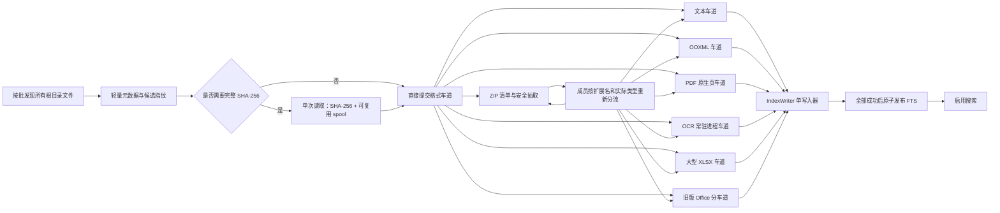

# LocalFullTextSearch 首次全量索引性能优化与未完成项开发需求

| 字段 | 内容 |
|---|---|
| 文档状态 | 待开发 |
| 编写日期 | 2026-07-30 |
| 当前代码基线 | `main` / `8455104` |
| 目标项目 | `everything-finder` / `LocalFullTextSearch` |
| 主要目标 | 在不降低索引完整性、OCR 精度和搜索准确性的前提下，显著减少第一次完整索引耗时 |
| 适用执行者 | Codex 开发代理 |

> 本文是当前代码复核后的增量开发规格。实施时以本文的“未完成项”和验收门禁为准，不要重复开发已经完成的 G1、G2、G5，也不要把仅有接口、日志或单元测试的半成品标记为完成。

---

## 0. Codex 执行指令

1. 先建立同一设备、同一语料、同一设置下的可重复基线，再修改实现。
2. 每个阶段先补测试，再修改代码；一个阶段验证通过后再进入下一阶段。
3. 不能用跳过文件、截断正文、降低 OCR 检测或识别分辨率、降低置信度、只索引文件名、减少 ZIP 成员等方式换取速度。
4. 普通模式和性能模式共享正确的解析架构；二者只允许资源并发配置不同，不能产生不同正文。
5. 开发完成后必须重新构建冻结版 EXE 和交付压缩包。只验证源码不算完成。
6. 所有性能结论必须给出修改前后数据、语料组成、缓存状态、硬件信息和重复次数。
7. 如果某项目受第三方库或 Office/WPS 环境限制无法达到目标，必须保留正确性，记录证据和剩余瓶颈，不得静默降级。

---

## 1. 已确认边界

### 1.1 完整索引门槛

- 视频文件不做内容解析，只登记文件名和路径，并单独统计为“排除视频”。
- 视频不计入可解析文件总数，不进入失败清单，也不提交 OCR、音频转写或抽帧任务。
- 不建立“长文件后台慢任务队列”。所有可解析文件必须在同一轮完整索引内完成。
- 建立或更新完整索引期间，搜索入口保持不可用；不能用上一版索引或部分索引向用户提供可能不完整的搜索结果。
- 只有全部可解析文件状态均为 `success`、FTS 已成功发布、索引不脏、没有运行中的索引任务时，搜索才可用。
- `partial_success`、`converter_missing`、`ocr_disabled`、`failed_retryable`、`failed`、`processing` 等状态均阻止搜索。
- 长文件产生的检查点、临时正文或缓存可用于恢复，但在整轮成功前不得发布到可搜索 FTS。

### 1.2 无进展超时

- 禁止恢复固定的 120 秒或其他“单文件总耗时上限”。
- 只允许“无语义进展超时”：持续产生页、ZIP 成员、内容块、工作表、行区间、OCR 区域或 Office 转换阶段进展的任务可以一直运行。
- 日志刷新、进程仍存活、CPU 占用、文件时间变化和重复心跳不算语义进展。
- 默认无进展阈值保持为：

| 任务类型 | 默认阈值 |
|---|---:|
| 普通解析 | 300 秒 |
| Office/PDF 解析进程 | 300 秒 |
| OCR | 900 秒 |
| ZIP | 900 秒 |
| 旧版 Office | 1800 秒 |

- 监控器必须独立于可能阻塞的解析调度线程，不能因为主调度背压而停止超时检查。
- 最多自动重试 3 次。PDF、ZIP、OCR 和大型 XLSX 从已确认的持久化检查点恢复；其他格式安全重启当前文件。
- 连续无进展后记录 `PARSE_NO_PROGRESS`、最后有效阶段、最后进展时间、重试次数、worker PID 和日志路径，完整索引保持未就绪。

### 1.3 当前已经完成、不要重做

| 编号 | 已有能力 | 本轮要求 |
|---|---|---|
| G1 | 首次添加搜索范围后不再自动弹出索引确认框 | 只做回归测试 |
| G2 | ZIP manifest 与抽取使用稳定成员序号，目录项不再导致错位 | 只做回归测试 |
| G5 | `dedup_*` 指标已保存并在界面显示 | 扩展指标时保持兼容 |
| OCR-A | 已采用“960 检测 + 原图文字区域识别 + 低质量时原图分块” | 必须保留，不能退回整图低分辨率识别 |
| DB-A | SQLite 单写入器和全量结束后统一构建 FTS | 必须保留 |
| ZIP-A | ZIP 成员已有虚拟文件来源和基础独立任务 | 在此基础上完善格式分流、一次抽取和恢复 |
| XLSX-A | 已有工作簿预扫描和 sheet/row 进度 | 在此基础上实现并行、低内存和持久恢复 |

---

## 2. 本轮必须完成的未实现项

| 编号 | 优先级 | 需求 | 当前缺口 | 完成定义 |
|---|---|---|---|---|
| P0-01 | P0 | PDF 原生页/OCR 页分流 | 启用扫描 PDF OCR 后，整份 PDF 仍进入 OCR 车道并趋向串行 | 原生页不渲染、不 OCR；仅扫描页进入 OCR 队列 |
| P0-02 | P0 | OCR 进程常驻与模型指纹优化 | OCR worker 按任务数回收，模型可能重复加载；运行时模型指纹仍有完整文件哈希成本 | 每轮稳定 OCR worker 只加载一次模型；模型指纹使用构建清单，不在每轮全量读取模型 |
| P0-03 | P0 | 单次读取/哈希流水线 | 图片、ZIP 候选和部分普通文件存在重复读取或重复 SHA-256 | 同一原始字节流在首轮处理时完成读取、哈希、缓存和解析供给 |
| P0-04 | P0 | 发现、指纹、解析流水化 | 当前按根目录完成发现和准备后才大规模解析，多个根目录顺序处理 | 分批发现后立即准备和解析，但搜索仍等整轮完成 |
| P0-05 | P0 | ZIP 成员按真实格式调度 | ZIP 成员虽可形成任务，但统一占用 ZIP 车道，内部 OCR/PDF 的资源成本未正确计入 | ZIP 车道只负责清单和安全抽取；成员进入文本、Office、PDF、OCR、旧版 Office或嵌套 ZIP 车道 |
| P0-06 | P0 | ZIP 一次抽取、精确去重和错误分类 | 候选成员可能在规划和解析阶段重复解压/哈希；部分错误仍映射过粗 | 每个待解析成员只抽取一次；候选筛选后才补完整 SHA；错误码准确 |
| P0-07 | P0 | 全局资源核算补齐 | ZIP 内 OCR 成本、解压后体积和多根目录磁盘类型未被完整计入 | CPU、内存、输入/解压字节和磁盘并发均受同一调度器约束 |
| P1-01 | P1 | 大型 XLSX 专项优化 | 已有预扫描和进度，但仍串行；共享字符串、超大 sheet 和跨启动恢复未完成 | 多 sheet 有界并行、共享字符串低内存访问、超大 sheet 检查点和真实大文件基准通过 |
| P1-02 | P1 | 旧版 Office 分车道 | `.doc/.xls/.ppt` 共用一个旧版 Office 车道 | Word、Excel、PowerPoint 独立受控车道，可跨类型并行且不泄漏外部进程 |
| P1-03 | P1 | 持久化长任务恢复 | PDF/ZIP 等部分检查点主要服务同一轮进程回收，取消或重启后仍可能重做当前长文件 | PDF 页、ZIP 成员、OCR 页/图、XLSX sheet/行区间可跨取消和应用重启恢复 |
| P1-04 | P1 | 启动诊断补齐 | 已有早期日志和原生提示，但缺 `faulthandler`、完整元数据、全部错误分类和冻结环境矩阵 | Python 入口后的启动失败均可定位；冻结包环境验证通过 |
| P1-05 | P1 | 性能配置与运行摘要补齐 | 有硬件配置对象，但运行配置未完整写入 `index_runs.summary_json`，多根目录只取首个盘类型 | 每轮保存实际生效配置、各车道成本、盘类型、降级原因和峰值资源 |
| P1-06 | P1 | 发布与打包闭环 | 当前 `dist` 早于源码提交，不能代表最新实现；冻结矩阵与发行文件不完整 | 干净重建、自动校验、冻结自测、说明和校验清单齐全 |

---

## 3. 目标流水线



### 3.1 流水线原则

1. 目录发现使用有界批次，建议按“最多 256 个文件或 64 MiB 预计输入量”形成一批，具体值由基准调优。
2. 不等待整个根目录完成枚举才开始解析；多个启用根目录应公平入队，不能让首个超大根目录长期阻塞其他根目录。
3. 发现、候选指纹、完整哈希、解析、写入各阶段均使用有界队列和背压，不能一次把数万任务全部放入内存。
4. 内部允许流水化和并发，但搜索可用状态只能在全部文件成功、单写入完成、FTS 原子发布后切换。
5. 中途取消时停止接收新批次，安全收集已确认检查点，回收进程；下一次继续时复用成功文件和持久检查点。

---

## 4. PDF 原生页与 OCR 页分流

### 4.1 两阶段流程

1. 第一阶段对每一页执行原生文本提取，生成页级结果和页级语义统计。
2. 只有满足扫描页或低有效文字条件的页面才进入 OCR 候选。
3. 第二阶段只渲染 OCR 候选页，并提交给 OCR 常驻进程。
4. 混合 PDF 中的原生页和扫描页可以并行，但最终内容块必须按页码稳定排序。
5. 启用“扫描 PDF OCR”不等于整份 PDF 进入 OCR 车道。

### 4.2 页分类规则

- 分类规则必须版本化，并记录到解析器版本或 OCR 缓存键。
- 不能只以字符数为唯一依据。应至少综合有效字符数、字符密度、空白比例、图片覆盖和异常乱码比例。
- 原生文本足够的页面不得调用页面渲染和 OCR。
- 对原生文本很少但包含重要小标签的页面，允许使用“原生文本 + OCR 补充”，但必须去除明显重复文本。
- 加密、损坏和权限限制 PDF 保持明确失败分类，不得静默转 OCR。

### 4.3 页级缓存与恢复

页级 OCR 缓存键至少包含：

```text
PDF 完整内容哈希
+ 页码
+ 渲染 DPI/色彩参数
+ 页面分类规则版本
+ OCR 配置版本
+ OCR 模型指纹
```

- 每个成功页面形成可校验的持久检查点。
- 取消、无进展回收或应用重启后，只重做未完成或校验失败的页。
- 检查点正文只写入 staging，不得在整轮完成前进入可搜索 FTS。

### 4.4 PDF 验收

- 纯原生 PDF 在开启扫描 PDF OCR 后，OCR 页数必须为 0。
- 混合 PDF 只对扫描页 OCR，原生页文本与旧版结果一致。
- 纯扫描 PDF 每页均被正确提交 OCR。
- 页面并发后正文顺序、页码和搜索定位不乱。
- 取消后再次继续，已完成页不重复 OCR。

---

## 5. OCR 进程常驻和模型指纹

### 5.1 常驻策略

- OCR 进程池在本轮第一次出现 OCR 任务时延迟启动，不能在主窗口出现前加载模型。
- 同一轮索引中，每个健康 OCR worker 只加载一次检测和识别模型。
- 不再按固定的 16 个任务无条件回收 OCR worker。
- 只有以下情况可以回收并重建 OCR worker：
  - worker 崩溃或无进展；
  - RSS 连续超过配置的硬上限；
  - 第三方库确认存在不可接受的持续内存增长；
  - 索引取消、完成或应用退出。
- Windows `spawn` 环境下不能为每张图片重新创建进程。
- OCR worker 的内部线程数必须计入全局 CPU 令牌。

### 5.2 模型指纹优化

构建时生成模型清单，至少包含：

```text
manifest_version
OCR engine/version
model family/version
relative path
file size
SHA-256
combined manifest digest
```

运行时规则：

1. OCR 缓存命名空间使用已签入或随包生成的 combined manifest digest。
2. 正常启动和每轮索引不得重新完整读取并哈希全部模型文件。
3. 运行时只做轻量完整性检查，例如清单版本、文件存在性、大小和必要的变更标记。
4. 打包阶段必须对模型文件执行完整 SHA-256 校验。
5. 若运行时发现模型大小或清单不匹配，记录 `OCR_MODEL_INTEGRITY_ERROR`，不得继续使用不确定模型产生正文。

### 5.3 保留现有自适应 OCR

- 保持“960 检测 + 原图文字区域识别 + 低质量时原图分块”。
- 960 仅用于文字区域检测，不得把 960 缩放图直接作为最终文字识别的唯一输入。
- 原图文字区域应批量送入识别器，避免逐框重复初始化。
- 低质量触发条件、分块大小、重叠比例和去重规则必须版本化。
- 图片和 PDF 页如果已有本轮预计算内容哈希，OCR 缓存必须直接接收该哈希，不能再次读取整张图片计算 SHA-256。

### 5.4 OCR 指标

每轮保存：

- `ocr_worker_start_count`
- `ocr_model_load_count`
- `ocr_model_load_ms`
- `ocr_model_manifest_check_ms`
- `ocr_cache_hit_count`
- `ocr_source_hash_reused_count`
- `ocr_detect_page_count`
- `ocr_recognized_region_count`
- `ocr_tiled_fallback_count`
- `ocr_worker_restart_count`

---

## 6. 单次读取、哈希与解析供给

### 6.1 基本要求

- 同一来源在一次索引运行内只有一个权威内容哈希结果。
- 禁止“先完整 SHA-256，再由解析器完整读一次，再由 OCR 缓存完整读一次”的重复路径。
- 需要完整哈希时，读取源文件的同时计算 SHA-256，并把同一字节流直接提供给解析器或写入受控 spool。
- 需要随机访问的第三方解析器可以读取 spool；不得再次从网络盘、U 盘或原始 ZIP 成员重复读取。
- spool 使用内容键命名、校验大小和摘要，完成后按引用计数清理。
- 对不需要完整 SHA 的非候选文件，不得为了统一流程无条件计算完整 SHA。

### 6.2 各格式规则

| 类型 | 规则 |
|---|---|
| TXT/LOG/CSV/MD/JSON/XML/INI | 编码探测读取的数据必须成为后续正文流前缀，不重复打开并重读相同区间 |
| 图片 | 文件指纹和 OCR cache 共用同一个 SHA-256 |
| PDF | 文件级哈希只计算一次；页级缓存引用文件哈希和页码 |
| DOCX/PPTX/XLSX | 中央目录候选指纹用于快速判断；只有精确复用候选才补完整 SHA |
| 旧版 Office | 转换缓存与文件去重共用同一个完整 SHA |
| ZIP 成员 | 解压时同步计算 SHA 并写入 spool，解析器消费同一 spool |

### 6.3 ZIP 去重候选协议

```text
候选键 =
  parser_name
  + parser_version
  + extension/actual_type
  + uncompressed_size
  + crc32
  + OCR/config version（如适用）

最终键 = sha256:<原始成员完整字节流>
```

- 候选键只用于减少完整哈希次数，绝不能作为内容相同的最终证据。
- 只有存在可复用候选时才补完整 SHA-256。
- 规划阶段不能先完整解压一次，物化阶段再完整解压一次。
- 完整 SHA、解析器版本和相关 OCR 配置一致后，才允许关联同一 `document`。

### 6.4 物理读取指标

至少记录：

- `source_open_count`
- `source_bytes_read`
- `full_hash_count`
- `full_hash_bytes`
- `hash_reused_count`
- `spool_write_bytes`
- `spool_reuse_count`
- `duplicate_source_read_avoided_bytes`

基准报告必须能证明图片、ZIP 候选和旧版 Office 转换路径不再重复完整读取。

---

## 7. ZIP 成员按格式调度

### 7.1 车道映射

| ZIP 成员类型 | 目标车道 |
|---|---|
| TXT/LOG/CSV/MD/JSON/XML/INI | 普通文本车道 |
| DOCX/PPTX | OOXML/Office 车道 |
| XLSX/XLSM | XLSX 车道 |
| PDF | PDF 原生页车道，必要页面再进入 OCR |
| JPG/JPEG/PNG/BMP/TIF/TIFF | OCR 车道 |
| DOC/XLS/PPT | 对应旧版 Word/Excel/PowerPoint 车道 |
| ZIP | 嵌套 ZIP 清单车道，受深度和解压预算限制 |
| 视频及不支持内容格式 | 仅登记来源或按现有规则排除，不做内容解析 |

ZIP 车道只负责：

1. 读取中央目录；
2. 目录结构、路径穿越、加密、数量、单成员大小、总解压大小和嵌套深度检查；
3. 生成稳定 `member key`；
4. 有界抽取、哈希和 spool；
5. 把成员任务提交到真实格式车道。

### 7.2 资源核算

- ZIP 内图片和扫描 PDF 必须消耗 OCR CPU 令牌与 OCR 内存预算，不能只按一个普通 ZIP 任务计费。
- 成员内存估算优先使用未压缩大小和格式膨胀系数，不得只使用压缩后大小。
- 同时存在多个 ZIP 时，共享全局解压字节预算、临时磁盘预算和打开文件句柄预算。
- 嵌套 ZIP 的所有后代仍计入同一全局预算。
- 慢速磁盘、网络盘和可移动盘自动降低并发抽取数。

### 7.3 稳定性和错误码

必须区分：

| 错误码 | 含义 |
|---|---|
| `ZIP_CONTAINER_CHANGED` | 索引期间外层 ZIP 整体发生变化 |
| `ZIP_DIRECTORY_CHANGED` | 中央目录结构或稳定成员键变化 |
| `ZIP_MEMBER_SIZE_CHANGED` | 指定成员未压缩大小变化 |
| `ZIP_MEMBER_CONTENT_CHANGED` | CRC 或完整内容校验变化 |
| `ZIP_MEMBER_ENCRYPTED` | 成员加密且不可读取 |
| `ZIP_PERMISSION_DENIED` | 权限不足 |
| `ZIP_FILE_IN_USE` | 能明确判断为占用或共享冲突 |
| `ZIP_SECURITY_LIMIT` | 路径、数量、体积、深度或压缩炸弹限制触发 |
| `ZIP_CORRUPT` | 压缩包结构损坏 |

- 禁止把所有 `OSError` 或稳定性变化统一映射成 `FILE_IN_USE`。
- 失败页显示外层路径、内部路径、成员序号、失败阶段、错误码和建议。

### 7.4 ZIP 恢复

- 每个成功成员形成持久检查点，包含外层 ZIP 指纹、稳定 member key、成员大小、CRC、完整 SHA、解析器版本和结果校验和。
- 外层 ZIP 未变化时，取消或重启后跳过已成功成员。
- 外层 ZIP 变化时，只失效受影响成员；不能无条件重做所有未变化成员。
- 成员结果最终按中央目录稳定顺序写入和显示，不受并发完成顺序影响。

---

## 8. 大型 XLSX 专项优化

### 8.1 必须保持的准确性

不得漏掉或改变：

- 工作表名称和工作表顺序；
- 单元格位置、值、公式文本和缓存值语义；
- 共享字符串、内联字符串、富文本；
- 批注/评论；
- 日期、数字、布尔值和错误值；
- 空单元格在现有解析语义中应保留的结构信息；
- 隐藏行列、合并单元格等当前已纳入正文的内容。

### 8.2 多 sheet 有界并行

- 预扫描完成后，将可独立工作表提交为有界子任务。
- 并行数由 XLSX 专用内存预算和 CPU 令牌控制，不能简单等于 sheet 数。
- 共享字符串和样式元数据不得在每个 worker 中完整复制一份。
- 最终内容块必须按 workbook 中的 sheet 顺序和 sheet 内行号稳定合并。
- 单 sheet 超大文件不能因为没有多 sheet 而失去细粒度进度和恢复能力。

### 8.3 共享字符串低内存访问

根据基准选择以下一种或等效方案：

- 流式建立字符串偏移索引并使用 `mmap`/按需读取；
- 写入临时 SQLite 或紧凑磁盘索引；
- 在内存预算允许时使用紧凑结构，并在阈值后自动切换磁盘结构。

要求：

- 不得为并行 sheet 重复解析完整 `sharedStrings.xml`。
- 共享字符串索引必须可校验、可清理，并纳入临时磁盘预算。
- 大型共享字符串表不能造成不可控峰值 RSS。

### 8.4 超大 sheet 和恢复点

- 至少按 sheet + 已确认行区间记录持久检查点。
- 行区间检查点必须落在完整 XML 元素边界，不能截断单元格或行。
- 取消、无进展回收和应用重启后，从最后已确认区间继续。
- 如果 XML 损坏或文件指纹变化，安全失效检查点并重新解析受影响 sheet。
- 进度至少包含：预扫描、共享字符串索引、当前 sheet、已处理行/预计行、输出块数、距上次有效进展时间。

### 8.5 XLSX 基准

必须包含：

1. `202601 服务资质报表.xlsx` 同量级样本：文件约 25.6 MiB、解压 XML 约 274 MiB、最大 sheet XML 约 180 MiB；
2. 多 sheet 且共享字符串较大的样本；
3. 单个超大 sheet 样本；
4. 稀疏单元格样本；
5. 公式、批注、合并单元格、隐藏行列和多语言文本样本。

验收时比较 3 次运行中位数，并记录总耗时、各阶段耗时、峰值 RSS、临时磁盘、内容块数和正文摘要。

---

## 9. 旧版 Office 分车道

### 9.1 车道设计

将当前 `legacy_office` 拆分为：

```text
legacy_word        -> .doc
legacy_excel       -> .xls
legacy_powerpoint  -> .ppt
legacy_fallback    -> 需要共享 WPS/LibreOffice 实例的保守回退
```

- Microsoft Word、Excel、PowerPoint COM 各自使用独立进程/会话，可在资源允许时跨类型并行。
- 同一种 Office 应用默认保持单任务，除非真实压力测试证明多实例稳定。
- WPS 或 LibreOffice 如果多个格式共享同一服务进程，必须进入 `legacy_fallback` 保守车道，不能假设三车道互不影响。
- 转换完成后的 DOCX/XLSX/PPTX 使用对应现代解析器，不能在旧版车道重复实现正文解析。

### 9.2 转换缓存和进程治理

- 原始文件完整 SHA 与转换缓存共用，不得重复哈希。
- 缓存键包含原文件 SHA、转换器类型、转换器版本、目标格式和关键设置。
- Office COM 使用正确的 STA 线程模型；禁止弹出可见窗口和交互对话框。
- 每个任务记录根进程和子进程 PID；取消、失败、超时和退出时只清理本任务创建的进程树。
- 不能终止用户自己打开的 Word、Excel、PowerPoint 或 WPS 进程。
- 区分无效 OLE、密码保护、转换器缺失、打开失败、保存失败、输出缺失、权限不足和无进展。
- 进度阶段至少包含：选择转换器、启动应用、打开源文件、保存目标文件、关闭应用、现代格式解析。

### 9.3 旧版 Office 验收

- `.doc/.xls/.ppt` 同时存在时，在资源允许设备上可跨类型并行。
- 每个格式的正文、表格/工作表和幻灯片文本与当前正确结果一致。
- 取消和异常后无 Codex 测试创建的 Office/WPS/LibreOffice 残留进程。
- 转换缓存命中时不启动外部 Office。
- 不安装 Microsoft Office 时，WPS/LibreOffice 回退行为和错误提示明确。

---

## 10. 全局资源调度与运行摘要

### 10.1 调度修正

- 不只检测第一个启用根目录的磁盘类型。每个根目录和 ZIP 外层来源保留自己的介质分类。
- SSD、HDD、网络盘、同步盘和可移动盘可以使用不同的读取并发，但共享全局 CPU 和内存硬上限。
- OCR 页、ZIP 内 OCR、PDF 渲染、XLSX 解压 XML、旧版 Office 外部进程的真实成本均计入资源模型。
- 内存预算不能只按压缩文件大小估计，应加入格式膨胀系数、模型常驻内存和实际 RSS 反馈。
- 当可用内存低于安全水位时只暂停提交新重任务，不终止仍有进展的任务。
- SQLite 始终保持单写入器，解析 worker 不持有写连接。

### 10.2 运行配置持久化

每轮 `index_runs.summary_json` 至少保存：

```json
{
  "mode": "normal|performance",
  "hardware": {},
  "root_disk_classes": {},
  "effective_profile": {},
  "lane_worker_limits": {},
  "cpu_token_budget": 0,
  "memory_budget_mb": 0,
  "peak_rss_bytes": 0,
  "lane_elapsed_ms": {},
  "lane_input_bytes": {},
  "lane_output_blocks": {},
  "fallback_and_throttle_events": [],
  "dedup_metrics": {},
  "pdf_metrics": {},
  "ocr_metrics": {},
  "zip_metrics": {},
  "xlsx_metrics": {},
  "legacy_office_metrics": {}
}
```

- 保存的是实际生效值，不只是默认设置值。
- 记录自动降级原因，例如网络盘、低内存、模型常驻内存过高或外部转换器限制。
- UI 任务详情显示关键值，完整明细保留在本地日志和数据库，不上传遥测。

---

## 11. 启动诊断未完成项

现有 `StartupDiagnostics` 保留并补齐：

1. 在重模块导入前启用 `faulthandler`，输出到实际可写的启动日志。
2. 安装 `sys.excepthook` 和 `threading.excepthook`，完整记录 traceback。
3. 每个阶段均记录开始、结束、耗时、EXE 路径、工作目录、冻结状态、Windows 版本、应用版本、设置路径、数据库路径和最后状态。
4. `%LOCALAPPDATA%` 不可写时回退 `%TEMP%`；原生错误框必须显示实际日志路径。
5. 明确区分：
   - 应用目录或关键模块缺失；
   - 用户数据目录不可写；
   - 数据库锁定、损坏、迁移失败；
   - Qt/DLL 加载失败；
   - 未知启动异常。
6. 主窗口 15 秒仍未显示时，显示非终止性的当前阶段和日志路径。
7. 下次启动能报告上一次未到达 `window_visible` 的阶段。
8. 完成冻结版验证矩阵：完整 onedir、缺关键文件、只复制 EXE、只读数据目录、数据库锁定、损坏数据库、Defender/EDR、网络目录、U 盘和压缩包预览运行。

系统在 Python 入口前拦截时可能无法生成日志，这一边界必须在分发说明中明确，不能宣称应用可以捕获所有 SmartScreen、EDR 或 DLL loader 失败。

---

## 12. 数据库、检查点与一致性

### 12.1 ZIP 来源索引

确认并补齐等效约束：

```sql
CREATE UNIQUE INDEX IF NOT EXISTS idx_files_zip_member_source
ON files(container_file_id, internal_path)
WHERE source_kind = 'zip_member' AND is_deleted = 0;

CREATE INDEX IF NOT EXISTS idx_files_source_kind
ON files(source_kind, container_file_id, is_deleted);

CREATE INDEX IF NOT EXISTS idx_files_content_hash_full
ON files(content_hash_full);
```

如果现有稳定虚拟 `path` 唯一约束已等效覆盖第一项，必须用迁移测试和并发插入测试证明；不能只凭代码判断。

### 12.2 持久检查点通则

检查点至少包含：

- 来源稳定标识与完整或可验证指纹；
- 解析器名称和版本；
- OCR/模型/渲染配置版本（如适用）；
- 已完成处理单元范围；
- 输出 spool 路径、大小和校验和；
- 创建时间、最后进展时间和重试次数。

规则：

- 检查点写入必须原子化，进程崩溃不能留下被误认为成功的半文件。
- 来源、解析器或配置变化后自动失效。
- 已发布成功文件继续使用现有增量索引结果。
- 未发布检查点只能用于恢复，不能被搜索。
- 完成整轮后回收无引用 spool 和过期检查点。
- 数据库迁移必须幂等，并在迁移前使用现有策略创建可恢复备份。

---

## 13. 测试与性能基准

### 13.1 正确性自动化测试

- 纯原生、纯扫描和混合 PDF 分流、页序、缓存及跨重启恢复。
- 图片哈希只计算一次，OCR cache 接收预计算摘要。
- OCR 常驻 worker 模型加载次数、崩溃重建、RSS 阈值重建和取消清理。
- 模型清单缺失、模型文件大小变化和构建期完整 SHA 校验。
- 流水化发现的背压、多个根目录公平性、取消和异常传播。
- ZIP 目录项、重复文件名、同内容成员、嵌套目录、嵌套 ZIP、加密、损坏、路径穿越和压缩炸弹限制。
- ZIP 成员按格式车道调度及真实 CPU/内存令牌计费。
- ZIP 成员只抽取一次，候选完整 SHA 只在必要时执行。
- ZIP 外层变化、单成员变化、取消、进程崩溃和跨重启恢复。
- XLSX 多 sheet 并行顺序、共享字符串、公式、批注、超大单 sheet、检查点失效和恢复。
- `.doc/.xls/.ppt` 分车道、转换缓存、转换器回退和进程残留。
- 完整索引门槛：任何可解析文件非 `success` 时搜索不可用。
- 视频只登记元数据，不进入解析或失败分母。
- 无进展超时：持续有语义进展的长任务永不因总耗时被终止；假死任务按车道阈值回收。
- 数据库迁移、删除传播、FTS 原子发布、失败回滚。
- 启动日志、错误分类、日志回退路径和上次失败摘要。

### 13.2 基准语料

至少准备以下可重复语料：

| 语料 | 最低覆盖 |
|---|---|
| 小文件集 | 10,000 个混合文本和小型 Office 文件 |
| PDF 集 | 原生、扫描、混合，各含小文件和 500 页以上长文件 |
| 图片集 | 低密度、高密度、小字、倾斜、低质量和超大原图 |
| ZIP 集 | 1,000 个以上成员、嵌套 ZIP、重复成员、Office/PDF/图片混合 |
| XLSX 集 | 25.6 MiB/274 MiB 解压量级、多 sheet、单超大 sheet、大 sharedStrings |
| 旧版 Office 集 | DOC/XLS/PPT 各不少于 20 个，含大文件、损坏和密码样本 |
| 混合真实目录 | 与现场数百至数万文件的格式比例接近 |

### 13.3 基准方法

- 同一台机器、同一电源模式、同一语料和同一设置。
- 冷缓存和热缓存分别测试，不混合统计。
- 修改前、每个 Phase 后和最终版本各运行至少 3 次，使用中位数。
- 记录发现、指纹、完整哈希、各解析车道、写库、FTS、总耗时、CPU、峰值 RSS、临时磁盘和物理读取字节。
- 对比内容块摘要、文件成功集合、失败集合、搜索命中集合和 OCR 文本；不能只比较文件数。
- ETA 不作为性能结论，必须使用真实完成耗时。

### 13.4 性能目标

以下为目标，不得以正确性回退达成：

1. 混合真实目录第一次完整索引中位耗时相对当前基线至少降低 30%。
2. 纯原生 PDF 在开启扫描 PDF OCR 时，不应产生 OCR 模型调用；耗时不得因开启该选项显著退化。
3. 稳定运行中每个 OCR worker 的模型加载次数为 1。
4. 运行时模型指纹检查不完整读取模型权重，热启动检查应为亚秒级。
5. 每张独立图片的完整 SHA-256 物理计算次数为 1。
6. 每个实际解析的 ZIP 成员完整抽取次数为 1。
7. 大型 XLSX 参考样本中位耗时相对当前基线至少降低 30%，且峰值 RSS 不高于设定预算。
8. DOC、XLS、PPT 混合语料能跨应用并行，且无外部进程残留。
9. 与当前版本相比，任何支持格式的正文、搜索命中和失败诊断不得出现无法解释的减少。

如果特定语料不具备某优化的适用条件，应在报告中标记“不适用”，不能用该语料宣称该项已完成。

---

## 14. 分阶段开发顺序

### Phase 0：基线与可观测性

- 固化基准语料和当前数据。
- 补齐物理读取、哈希、模型加载、页分流、ZIP 抽取、XLSX 阶段和旧版 Office 车道指标。
- 保存实际 `RunResourceProfile` 到运行摘要。

完成条件：能准确说明当前总耗时消耗在哪个阶段，并能统计重复读取和模型重复加载。

### Phase 1：PDF 分流与 OCR 常驻

- 实现 PDF 两阶段页分流。
- 实现页级 OCR 缓存和持久检查点。
- 实现 OCR worker 懒启动、常驻和基于异常/RSS 的回收。
- 实现构建期 OCR 模型清单和运行时轻量指纹。

完成条件：PDF/OCR 正确性、取消恢复、进程回收和冻结版 OCR 测试通过。

### Phase 2：单次读取和全局流水线

- 合并内容哈希、OCR cache、转换缓存和解析供给。
- 引入有界 spool 和引用计数清理。
- 将根目录发现、准备和解析改为有界流水线。
- 验证网络盘、HDD、SSD 和多根目录公平性。

完成条件：重复读取指标达到要求，取消后无临时文件泄漏，搜索门槛不变。

### Phase 3：ZIP 按格式调度

- ZIP 车道收敛为清单和安全抽取。
- 成员按真实格式提交对应车道。
- 实现一次抽取、候选 SHA、稳定错误码和持久成员检查点。
- 补齐解压后体积、嵌套深度和 OCR 成本核算。

完成条件：混合大 ZIP 并发、取消、崩溃、变化检测、顺序和安全测试通过。

### Phase 4：大型 XLSX

- 共享字符串低内存索引。
- 多 sheet 有界并行。
- 单超大 sheet 细粒度检查点和恢复。
- 真实 25.6 MiB/274 MiB 量级文件基准。

完成条件：正文摘要一致，性能和内存目标达到或有可复核的第三方限制证据。

### Phase 5：旧版 Office 分车道

- 拆分 Word、Excel、PowerPoint 和共享回退车道。
- 共用完整 SHA 和转换缓存。
- 完成 Office/WPS/LibreOffice 环境矩阵及进程残留测试。

完成条件：跨类型并行有效，转换正确，无用户进程误杀。

### Phase 6：启动诊断、冻结包与发布

- 补齐启动诊断未完成项。
- 运行全部自动化测试和真实基准。
- 清理经确认的旧 `build`、`dist` 和临时打包目录后执行干净构建。
- 自动生成并验证 `SHA256SUMS.txt`、启动与分发说明和版本/提交清单。
- 在冻结 EXE 中运行 self-test、核心格式、OCR、进程池、数据库锁、取消退出和启动失败矩阵。

完成条件：源码、冻结包和交付压缩包均通过发布门禁。

---

## 15. 发布门禁

只有同时满足以下条件才可声明开发完成：

1. 全部自动化测试通过，新增需求有对应测试，不只复用旧测试。
2. 普通模式和性能模式的正文集合、失败集合及搜索命中集合一致。
3. 所有可解析文件成功并完成 FTS 发布前，搜索始终不可用。
4. 视频未被解析，且排除统计正确。
5. 不存在固定总耗时上限；持续有语义进展的长文件不会被终止。
6. PDF 分流、OCR 常驻、单次读取、ZIP 格式调度、XLSX 和旧版 Office 分车道均有结构指标及真实样本证明。
7. 取消、无进展回收、进程崩溃和应用重启后，检查点恢复正确且未发布半成品正文。
8. 运行结束后无测试创建的 Python、OCR、Word、Excel、PowerPoint、WPS 或 LibreOffice 残留进程。
9. 冻结 EXE 的核心格式、OCR、进程池、数据库和启动诊断测试通过。
10. 新交付包由当前源码干净构建，文件时间、版本和提交清单一致，不得继续交付旧 `dist`。
11. 构建流程自动验证完整目录和 SHA-256；不要求最终用户手工逐文件比对。
12. 提交最终验证报告，包含基线、修改后数据、未达目标项、已知限制和回滚方式。

---

## 16. 预期交付物

- 上述功能的源码和数据库迁移；
- 新增及更新后的自动化测试；
- 可重复执行的基准脚本与固定语料说明；
- 修改前后性能验证报告；
- 最新冻结版 onedir 应用；
- 最新交付压缩包；
- `SHA256SUMS.txt`；
- 启动与分发说明；
- 数据库和检查点迁移/回滚说明；
- 本轮新增指标字段说明。
